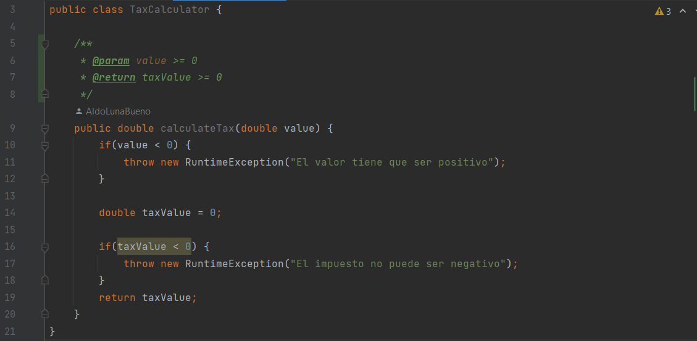
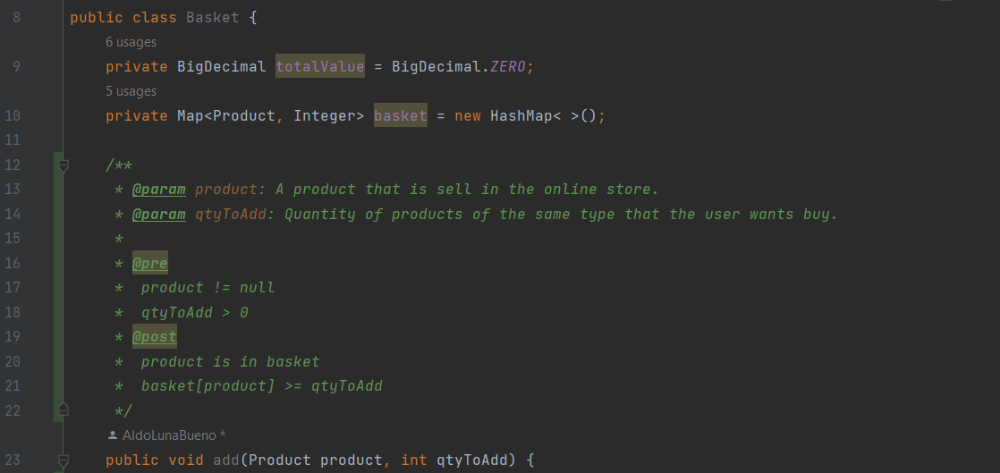
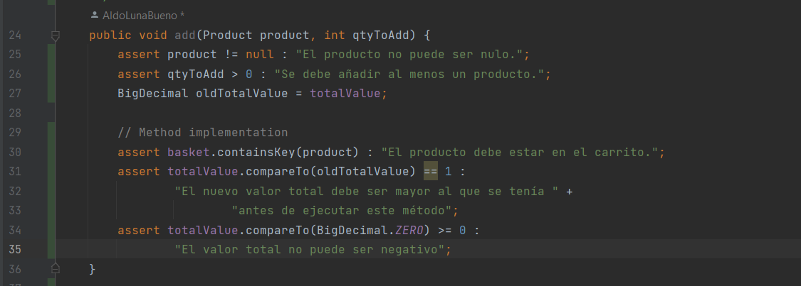

# Diseño de contratos <!-- omit in toc -->

- [Introducción](#introducción)
- [Precondiciones y postcondiciones](#precondiciones-y-postcondiciones)
- [La palabra clave assert](#la-palabra-clave-assert)
- [Precondiciones  y postcondiciones fuertes y débiles](#precondiciones--y-postcondiciones-fuertes-y-débiles)
- [Invariantes](#invariantes)
- [¿Cómo se relaciona el diseño por contrato con las pruebas?](#cómo-se-relaciona-el-diseño-por-contrato-con-las-pruebas)
- [¿Precondiciones débiles o fuertes?](#precondiciones-débiles-o-fuertes)
- [¿Validación de entrada, contratos o ambos?](#validación-de-entrada-contratos-o-ambos)
- [Aserciones y excepciones: Cuándo usar una u otra](#aserciones-y-excepciones-cuándo-usar-una-u-otra)
- [¿Deberíamos escribir pruebas para precondiciones, postcondiciones e invariantes?](#deberíamos-escribir-pruebas-para-precondiciones-postcondiciones-e-invariantes)
- [Soporte de herramientas](#soporte-de-herramientas)
- [Cuándo no usar el diseño por contrato](#cuándo-no-usar-el-diseño-por-contrato)


En esta actividad debes crear un proyecto llamado `Contratos` y configurar el archivo `pom.xml` para utilizar JUnit 5.

Sube el proyecto a un repositorio con el nombre de la actividad de manera individual con todos tus resultados.

---
## Introducción

Imagina una pieza de software que maneja un proceso financiero muy complejo. Para que suceda esa gran rutina, el sistema de software encadena llamadas a varias subrutinas (o clases) en un flujo complejo de información: es decir, los resultados de una clase se pasan a la siguiente clase, cuyos resultados se pasan nuevamente a la siguiente clase  y así. 

Como es habitual, los datos provienen de diferentes fuentes, como bases de datos, servicios web externos y usuarios. En algún momento de la rutina, se llama a la clase `TaxCalculator` (que maneja el cálculo de un impuesto específico).

De los requisitos de esta clase, el cálculo solo tiene sentido para números positivos. 

## Precondiciones y postcondiciones 

Del ejemplo del cálculo de impuestos, debemos reflexionar sobre las precondiciones que el método necesita para funcionar correctamente, así como sus postcondiciones: lo que el método garantiza como resultados. 

Ya mencionamos una precondición: el método no acepta números negativos. Una posible postcondición de este método es que tampoco devuelve números negativos.
 

Una vez que se establecen las precondiciones y postcondiciones del método, es hora de agregarlas al código fuente. 

Hacerlo puede ser tan simple como una instrucción `if` como se muestra en la siguiente lista.


```java
public class TaxCalculator {
    public double calculateTax(double value) {

       if(value < 0) {
        	     throw new RuntimeException("...");
    	}
      double taxValue = 0;
``` 

La postcondición también se implementa como un simple if. Si algo sale mal, lanzamos una excepción, alertando al consumidor que la postcondición no se cumple

```java
    ...
    if(taxValue < 0) { 
        throw new RuntimeException("...");
    }

    return taxValue;
    ...
``` 

Dejar claras las precondiciones y poscondiciones en la documentación también es fundamental y muy recomendable. 

**Pregunta:** Escribe el Javadoc del método `calculateTax` describiendo su contrato, en el código anterior. Revisa el archivo `TaxCalculator.java`.

**Respusta:**



## La palabra clave assert

El lenguaje Java ofrece la palabra clave `assert`, que es una forma nativa de escribir aserciones. En el ejemplo anterior, en lugar de lanzar una excepción, podríamos escribir `assert value >= 0 : " Valor no puede ser negativo"`. Si `value` no es mayor o igual a 0, la máquina virtual de Java (JVM) generará un `AssertionError`. 

**Pregunta:**  Escribe una versión de `TaxCalculator` usando asserts para ello completa el archivo `TaxCalculator1.java`.

**Respusta:**


Decidir si usar instrucciones `assert` o declaraciones `if `simples que arrojan excepciones es algo para discutir con los miembros de tu equipo.

## Precondiciones  y postcondiciones fuertes y débiles

Al definir precondiciones y postcondiciones, una decisión importante es cuán débiles o fuertes deseas que sean. En el ejemplo anterior manejamos la precondición con mucha fuerza: si entra un valor negativo, viola la precondición del método, por lo que detenemos el programa. 

Una forma de evitar detener el programa debido a números negativos sería debilitar la precondición. En otras palabras, en lugar de aceptar solo valores mayores que cero, el método podría aceptar cualquier valor, positivo o negativo. 

```
public double calculateTax(double value) {
	No hay precondiciones para verificar,cualquier valor es válido
   // metodos
}
``` 

Las precondiciones más débiles facilitan que otras clases invoquen el método. Después de todo, sin importar el valor que le pases a `calculateTax`, el programa devolverá algo. 
Esto contrasta con la versión anterior, donde un número negativo arroja un error. 

**Pregunta:** ¿Puedes aplicar el mismo razonamiento a las postcondiciones? , ¿como relacionas el siguiente listado que devuelve un código de error en lugar de una excepción?

```java
public double calculateTax(double value) {
// verificación de la precondición
    if (value < 0) {
      return 0;
	}
  //...
}
``` 

**Respuesta** No se puede aplicar lo mismo a las postcondiciones porque debilitarlas rompería el código del cliente. Solo se pueden fortalecer.

## Invariantes 

Hemos visto en clase que las precondiciones deben cumplirse antes de la ejecución de un método y las postcondiciones deben cumplirse después de la ejecución de un método. 

A las condiciones que siempre deben cumplirse antes y después de la ejecución de un método se llaman **invariantes**. 

Un invariante es, por lo tanto, una condición que se mantiene durante toda la vida útil de un objeto o una estructura de datos. 

Imagina una clase `Basket` (canasta o carrito de compras) que almacena los productos que el usuario compra en una tienda en línea. La clase ofrece métodos como  `add(Product p, int quantity)`, que agrega una cantidad `qtyToAdd` de productos `p`,  y `remove(Product p)`, que elimina el producto `p` por completo del carrito.

Aquí hay un esqueleto de la clase.

```java
public class Basket {
  private BigDecimal totalValue = BigDecimal.ZERO;
  private Map<Product, Integer> basket = new HashMap<>();
 
  public void add(Product product, int qtyToAdd) {

  }

  public void remove(Product product) {

  }
}

``` 

**Pregunta:** Escribe para el método `add()` sus pre/postcondiciones.    

**Respuesta:**



**Pregunta:** Modela otras postcondiciones aquí, como `el nuevo valor total debe ser mayor que el valor total anterior`. Usa  la clase `BigDecimal` en lugar de un `double`. 
`BigDecimals` se recomienda siempre que desees evitar problemas de redondeo que pueden ocurrir cuando usas doubles. 

**Respuesta:**


**Pregunta:** Escribe las pre/post condiciones del método `remove()`.

**Respuesta:**


Independientemente de los productos que se agreguen o eliminen de `basket`, el valor total `totalValue` nunca debe ser negativo. Esta no es una precondición ni una poscondición: es un invariante y la clase es responsable de mantenerlo. 

**Pregunta:** Explica y completa el siguiente listado de invariantes de la clase `Basket`:

```java
public class Basket {
   private BigDecimal totalValue = BigDecimal.ZERO;
   private Map<Product, Integer> basket = new HashMap<>();
   

  public void add(Product product, int qtyToAdd) {
       assert product != null : "...";
        assert qtyToAdd > 0 : "...";
         BigDecimal oldTotalValue = totalValue;

      assert basket.containsKey(product) : "...";
     assert totalValue.compareTo(oldTotalValue) == 1 : "...";
   
    assert totalValue.compareTo(BigDecimal.ZERO) >= 0 :
    	"..."

    }

    public void remove(Product product) {
       assert product != null : "...";
       assert basket.containsKey(product) : "...";


      assert !basket.containsKey(product) : "...";
      assert totalValue.compareTo(BigDecimal.ZERO) >= 0 :
           "El valor total no puede ser negativo ."
    }
}
``` 

**Respusta:**




**Pregunta:**  ¿Qué función tiene el método `invariant()`  en el siguiente listado?

```java
  public void add(Product product, int qtyToAdd) {
      // ... methods ...
      assert invariant() : "...";
  }
  public void remove(Product product) {
      // ... methods ...
      assert invariant() : "...";
  }
  private boolean invariant() {
      return totalValue.compareTo(BigDecimal.ZERO) >= 0;
  }
```

**Respuesta:**

La función del método `invariant()` es la de encapsular las condiciones que no son ni precondiciones ni postcondiciones, es decir, las condiciones invariantes.

¿Qué pasa si cambiamos el contrato de una clase o método? Supongamos que el método `calculateTax` que discutimos anteriormente necesita nuevas precondiciones. 
En lugar de `el valor debe ser mayor o igual a 0`, se cambia a `el valor debe ser mayor o igual a 100`. ¿Qué impacto tendría este cambio en el sistema y nuestras suites de prueba?

La forma más sencilla de comprender el impacto de un cambio no es mirar el cambio en sí mismo o la clase en la que se está produciendo el cambio, sino todas las demás clases (o dependencias) que pueden usar la clase cambiante. 

## ¿Cómo se relaciona el diseño por contrato con las pruebas? 

Definir precondiciones, postcondiciones e invariantes claras (y automatizarlas en tu código mediante, por ejemplo, aserciones) ayuda a los desarrolladores de muchas maneras. 

Primero, **las aserciones aseguran que los errores se detecten temprano en el entorno de producción.** Tan pronto como se viola un contrato, el programa se detiene en lugar de continuar con su ejecución, lo que suele ser una buena idea. El error que obtiene de una violación de aserción es muy específico y sabes exactamente para qué depurar. Este puede no ser el caso sin aserciones. 

Imagina un programa que realiza cálculos. El método que hace el cálculo pesado no funciona bien con números negativos. Sin embargo, en lugar de definir dicha restricción como una precondición explícita, el método devuelve una salida no válida si ingresa un número negativo. 

Este número no válido luego se pasa a otras partes del sistema, lo que puede provocar otro comportamiento inesperado. Dado que el programa no falla per se, puede ser difícil para el desarrollador saber que la causa raíz del problema fue una violación de la precondición. 

En segundo lugar, **las precondiciones, las postcondiciones y las invariantes brindan a los desarrolladores ideas sobre qué probar.**
Tan pronto como vemos la precondición `qty > 0`, sabemos que esto es algo para ejercitar a través de pruebas unitarias, de integración o de sistema. 

Por lo tanto, los contratos no reemplazan las pruebas (unitarias): las complementan. 

En tercer lugar, **estos contratos explícitos facilitan mucho la vida de los consumidores.** La clase (o servidor, si se piensa en ella como una aplicación cliente-servidor) hace su trabajo siempre que el consumidor (o cliente) utiliza correctamente sus métodos. 

Si el cliente usa los métodos del servidor para que se mantengan sus precondiciones, el servidor garantiza que las postcondiciones se mantendrán después de la llamada al método. En otras palabras, el servidor se asegura de que el método entregue lo que promete. 

Supongamos que un método espera solo números positivos (como precondición)  promete devolver solo números positivos (como postcondición). Como cliente, si pasas un número positivo,  seguro de que el servidor devolverá un número positivo y nunca un número negativo. El cliente, por tanto, no necesita comprobar si la devolución es negativa, simplificando su código. 

No se ve el diseño por contrato como una práctica de prueba per se. Se ve más como una técnica de diseño. Por eso también se incluye en la parte de desarrollo del flujo de trabajo de prueba del desarrollador. 

## ¿Precondiciones débiles o fuertes? 

Una decisión de diseño muy importante cuando se modelan contratos es si utilizar contratos fuertes o débiles. **Esta es una cuestión de compensaciones.**

Considera un método con una precondición débil. Por ejemplo, el método acepta cualquier valor de entrada, incluido nulo. Este método es fácil de usar para los clientes: cualquier llamada funcionará y el método nunca generará una excepción relacionada con la violación de una precondición (ya que no hay precondiciones que violar). Sin embargo, esto supone una carga adicional para el método, ya que tienes que manejar entradas no válidas. 

Ahora considera a una precondición fuerte. El método solo acepta números positivos y no acepta valores nulos. La carga adicional ahora está del lado del cliente. El cliente debe asegurarse de que no viole las precondiciones del método. Esto puede requerir un código adicional.

No hay un camino claro a seguir, y la decisión debe tomarse considerando todo el contexto. 

## ¿Validación de entrada, contratos o ambos? 

Los desarrolladores son conscientes de la importancia de la validación de entrada. Un error en la validación puede dar lugar a vulnerabilidades de seguridad. Por lo tanto, los desarrolladores a menudo manejan la validación de entrada cada vez que los datos provienen del usuario final. 

La validación garantiza que los datos incorrectos o inválidos que puedan provenir de los usuarios no se infiltren en nuestros sistemas.  De esto se trata la validación: valida que los datos que provienen del usuario son correctos y si no, devuelve un mensaje.

Por otro lado, los contratos aseguran que la comunicación entre clases se realice sin problemas. No esperamos que ocurran problemas: los datos ya están validados. Sin embargo, si ocurre una violación, el programa se detiene, ya que sucedió algo inesperado. 

Tanto la validación como los contratos deberían ocurrir, ya que son diferentes. La cuestión es cómo evitar la repetición. Tal vez la validación y la precondición sean las mismas, lo que significa que hay una repetición de código o que la verificación se realiza dos veces. 

Como regla general, hay que evitar la repetición (DRY). Tu arquitectura debe garantizar que algunas zonas del código sean seguras y que los datos ya se hayan limpiado. 

Por otro lado, si un contrato es muy importante y nunca debe romperse (el impacto podría ser significativo), no importa usar un poco de repetición y poder computacional adicional para verificarlo tanto en el momento de la validación de entrada como en el momento de la verificación del contrato. 


**Lectura:** Arie van Deursen ofrece una respuesta clara en Stack Overflow sobre las diferencias entre el diseño por contrato y la validación: https://stackoverflow.com/a/5452329.

## Aserciones y excepciones: Cuándo usar una u otra 

Java no ofrece un mecanismo claro para expresar contratos de código.  La palabra clave `assert` en Java está bien, pero si olvidas habilitarla en el tiempo de ejecución, es posible que los contratos no se verifiquen en producción. Es por eso que muchos desarrolladores prefieren usar excepciones (marcadas o no marcadas). 

Aquí hay una regla general: 

- Si estas modelando los contratos de una biblioteca o clase de utilidad, se prefiere las excepciones. 
- Si estas modelando clases de negocios y sus interacciones y los datos se limpiaron en capas anteriores (por ejemplo, en el controlador de una arquitectura Model-View-Controller [MVC]), se prefiere las aserciones. 
- Si estás modelando clases de negocios pero no estas seguro de si los datos ya se limpiaron, usa excepciones. 

Hay que modelar las validaciones de formas más elegantes ¿?.

Si tienes curiosidad, revisa el patrón `Specification` propuesto por Eric Evans en el libro Domain-Driven Design (2004). 

Finalmente, usa excepciones nativas de Java, como RuntimeException. En la práctica, es posible que prefieras lanzar excepciones semánticas y más especializadas, como `NegativeValueException`. Eso ayuda a los clientes a tratar las excepciones comerciales de manera diferente al comportamiento excepcional real de uno en un millón. 

## ¿Deberíamos escribir pruebas para precondiciones, postcondiciones e invariantes? 

En cierto modo, las aserciones, las precondiciones, las postcondiciones y las verificaciones invariantes prueban el código de producción desde adentro. ¿También necesitamos escribir pruebas (unitarias) para ellos? 

Para responder a esta pregunta, veamos la diferencia entre validación y precondiciones. La validación es lo que haces para asegurarte de que los datos sean válidos. Las precondiciones establecen explícitamente bajo qué condiciones se puede invocar un método. 

Normalmente se escriben pruebas automatizadas para la validación si queremos asegurarnos de que los mecanismos de validación estén en su lugar y funcionen como se esperaba. Por otro lado, rara vez se escribe pruebas para las aserciones. Naturalmente, están cubiertas por pruebas que se centran en otras reglas comerciales. 

**Lectura:** Revisar respuesta de Arie van Deursen en Stack Overflow sobre cómo escribir pruebas para aserciones:https://stackoverflow.com/a/6486294/165292. 

**Nota:** Algunas herramientas de cobertura de código no manejan bien las aserciones. JaCoCo, por ejemplo, no puede informar la cobertura completa en las aserciones. 
Este es otro gran ejemplo de por qué no se debe usar los números de cobertura a ciegas. 

## Soporte de herramientas

Cada vez hay más compatibilidad con las comprobaciones de las pre/postcondiciones incluso en lenguajes como Java. Por ejemplo, IntelliJ, ofrece las anotaciones `@Nullable` y `@NotNull`: https://www.jetbrains.com/help/idea/annotating-source-code.html. Puedes anotar tus métodos, atributos o devolver valores con ellos, e IntelliJ te alertará sobre posibles violaciones. 

IntelliJ puede incluso transformar esas anotaciones en comprobaciones `assert` adecuadas en el momento de la compilación. 

## Cuándo no usar el diseño por contrato 

Comprender cuándo no usar una práctica es tan importante como saber cuándo usarla. En este caso, no hay una sola buena razón para no utilizar las ideas de diseño por contrato. El desarrollo de sistemas orientados a objetos tiene que ver con garantizar que los objetos puedan comunicarse y colaborar correctamente. 

La experiencia me muestra que hacer que las precondiciones, las postcondiciones y las invariantes sean explícitas en el código no es costoso y no lleva mucho tiempo. Por lo tanto, se recomienda que consideres usar este enfoque. 

Hay que resaltar que el diseño por contrato no reemplaza la necesidad de realizar pruebas. ¿Por qué? Porque no se puede expresar todo el comportamiento esperado de un fragmento de código únicamente con precondiciones, postcondiciones e invariantes. 

En la práctica, diseña contratos para garantizar que las clases puedan comunicarse entre sí y realiza pruebas para asegurarse de que el comportamiento de la clase sea el correcto.


