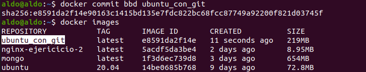
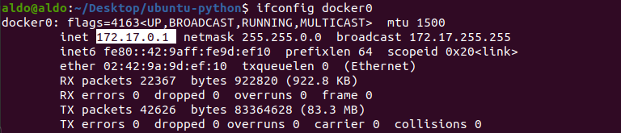

# Introducción a Docker <!-- omit in toc -->

- [Reinicia un contenedor de forma interactiva](#reinicia-un-contenedor-de-forma-interactiva)
- [Crea una imagen](#crea-una-imagen)
- [Dockerfile](#dockerfile)
- [Copiar contenido dentro del sistema de archivos de una imagen Docker](#copiar-contenido-dentro-del-sistema-de-archivos-de-una-imagen-docker)
- [Punto de entrada](#punto-de-entrada)
- [Variables de entorno](#variables-de-entorno)
- [Contenedor en segundo plano](#contenedor-en-segundo-plano)
- [Redes Docker](#redes-docker)
  - [Asignación automática de puertos](#asignación-automática-de-puertos)
- [Volúmenes de Docker](#volúmenes-de-docker)
- [Nombrar un contendor](#nombrar-un-contendor)
- [Limpiar el sistema de Docker](#limpiar-el-sistema-de-docker)

> Esta es la [guía de la actividad.](https://github.com/kapumota/Actividades/blob/main/Docker.md)

La instalación de Docker Engine se logró realizar sin problemas. Solo usamos estos comandos:

```bash
sudo apt-get update 
sudo apt-get -y install ca-certificates curl gnupg  lsb-release 
curl -fsSL https://download.docker.com/linux/ubuntu/gpg | sudo gpg --dearmor -o /usr/share/keyrings/docker-archive-keyring.gpg 

echo "deb [arch=$(dpkg --print-architecture) signed-by=/usr/share/keyrings/docker-archive-keyring.gpg] https://download.docker.com/linux/ubuntu $(lsb_release-cs) stable" | sudo tee /etc/apt/sources.list.d/docker.list > /dev/null 
sudo apt-get update 
sudo apt-get -y install docker-ce docker-ce-cli containerd.io
```

Y con este comando evitamos tener que escribir _sudo_ cada vez que queramos usar Docker:

```bash
sudo usermod -aG docker <username>
```

Sin embargo, Docker Desktop si presentó un problema. Al parecer, el módulo _qemu_ que usa para la parte gráfica es el problema:


Pero en [este foro](https://askubuntu.com/questions/328748/how-to-enable-nested-virtualization-in-ubuntu) se afirma que el módulo KVM no se puede correr en una VM de VirtualBox 6, que es la versión con la que actualmente contamos.

### Reinicia un contenedor de forma interactiva

Creamos un contenedor con el SO Ubuntu 20.04, y especificamos que se abra con la línea de comandos Bash.


Pero ¿qué pasa si salimos? ¿Qué comando usamos para volver a correr el SO desde la línea de comandos? No basta `docker restart <container>`. Falta la opción de interacción:

```
docker restart -i <container>
```

### Crea una imagen

Luego de haber instalado git en el contenedor anterior con Ubuntu 20.04, creamos una imagen de este contenedor con todo lo que tiene extra: 

```
docker commit <container> <new_image_name>
```



### Dockerfile

Podemos automatizar este proceso de crear una imagen usando un lenguaje incorporado de Docker. Un Dockerfile usa este lenguaje para contener todas las instrucciones que se pueden hacer manualmente. Para esto se aplica el siguiente comando, cuyo último argumento representa la ubicación del Dockerfile.

```bash
docker build -t <automated_image_tag> <Dockerfile_location>
```

El indicador -t describe la etiqueta de la imagen.

### Copiar contenido dentro del sistema de archivos de una imagen Docker

FROM usa una imagen como base para crear otra imagen. RUN corre los comandos para construirla. Y ahora vamos a ver que COPY copia archivos para introducirlos en el sistema de archivos de la imagen que estamos creando. Estos archivos copiados luego pasan a forma parte de cualquier contenedor que creemos a partir de la imagen.

```dockerfile
FROM ubuntu:20.04 
RUN apt-get update && \ 
apt-get install -y python 
COPY hola.py . 
ENTRYPOINT ["python", "hola.py"] 
```

En el comando COPY, el archivo copiado es _hola.py_ y el destino es la misma raíz del sistema de archivos, lo cual está representado por un simple punto. El archivo en cuestión contiene la siguiente línea de código:

```python
print("¡Hola mundo desde Python!") 
```

### Punto de entrada

¿Por qué se usan corchetes para la instrucción `ENTRYPOINT`? La sintaxis del lenguaje de un Dockerfile tiene dos formas: shell form y exec form.

**Shell form:**
```dockerfile
<instruction> <command>
```
Ejemplo:
```dockerfile
RUN apt-get install python3
CMD echo "Hello world"
ENTRYPOINT echo "Hello world"
```

**Exec form:**
```dockerfile
<instruction> ["executable", "param1", "param2", ...]
```

Por ejemplo, se puede hacer lo siguiente:

```dockerfile
RUN ["apt-get", "install", "python3"]
CMD ["/bin/echo", "Hello world"]
ENTRYPOINT ["/bin/echo", "Hello world"]
```

Pero se prefiere reservar la sintaxis exec solo para instrucciones como `ENTRYPOINT` o `CMD`.

### Variables de entorno

Ahora cambiamos el contenido del archivo _hola.py_ que vamos a copiar. El objetivo es que el texto muestre el valor de una variable (aquí una cadena) especificada al correr el contenedor. Estas son las nuevas instrucciones de _hola.py_:

```python
import os
print("Hola mundo dice %s" % os.environ['NAME'])
```

En este caso, el valor de la variable es la cadena "Ako". Vemos que ahora el terminal nos arroja un error si no especificamos la variable de entorno _NAME_. La especificamos con la opción _-e NAME ako_ luego:


También se puede especificar la variable de entorno desde el propio Dockerfile con el comando ENV:

```dockerfile
ENV NAME Ako
```

### Contenedor en segundo plano

Para ejecutar un contenedor en segundo plano usamos la opción _-d_ (--detach 'despegar').

```bash
docker run -d -t ubuntu:20.04
```

**Información:**

También se puede crear un contenedor sin ejectuarlo:

```bash
docker create -t ubuntu:20.04
```

### Redes Docker

Aquí vamos a aprender cómo exponer el puerto de un servicio que corre dentro de un contenedor Docker. Algunos ejemplos de servicios pueden ser:

- sitio web
- servicio web
- servicio de aplicación
- base de datos
- servidor de caché

Aquí ejecutamos un contendor con Tomcat (servicio de aplicación) como un demonio usando la opción -d:


Pero no se ve en el servidor local http://localhost:8080


¿Por qué? El contendor con Tomcat tiene expuesto por defecto el puerto 8080, pero este puerto está dentro del contendor. Necesitamos contectarlo al puerto externo del servidor donde está el demonio de Docker para poder verlo en el localhost. Esto se llama publicar el puerto y se hace con la siguiente opción al ejecutar el contendor con el comando `docker run`:

```
-p, --publish <host_port>:<container_port> 
```

Probamos otra vez:

```bash
docker run -d -p 8080:8080 tomcat
```


Entonces, hemos logrado que ala aplicación en el contendor se conecte con Internet. Esto es posible gracias a que hay una interfaz de red: docker0. La interfaz docker0 es creada por el demonio Docker para conectarse con el contenedor.

La información sobre esta interfaz se puede consultar con este comando:

```
ifconfig docker0
```



Esta interfaz, como es lógico, tiene asociada una ip: 172.17.0.1

**Nota.** Docker también nos permite publicar en la interfaz de red del host específico:

```
-p  <ip>:<host_port>:<container_port>
```

¿Y qué hay de la información de configuración de red del contendor? Se obtiene con este comando:

```bash
docker inspect <container>
```

Buscamos el campo NetworkSettings


Aquí notamos dos cosas interesantes. En la primera captura se especifica el puerto interno que el contendor tiene por defecto: 8080. Esto es así porque en el Dockefile oficial en Docker Hub que permitió crear localmente la imagen de Tomcat hay una línea que especifica el puerto que debe ser expuesto:

```dockerfile
EXPOSE 8080 
```

Esto no significa que el puerto vaya a ser expuesto. Como vimos, hace falta especificarlo con la opción -p, que mapea un puerto del servidor donde esta el demonio de Docker con el puerto del contenedor.

En la segunda captura nos damos cuenta de que la ip de la interfaz de red docker0 es el gateway aquí. Y tiene su propia ip: 172.17.0.3. Si crearamos otro servidor de aplicación como hicimos, tendría la ip 172.17.0.4. El primero que hicimos, cuyo puerto no publicamos, tiene la ip 172.17.0.2.

#### Asignación automática de puertos

También podemos asignar automaticamente puertos sin especificar el puerto externo del demonio Docker. Podemos especificar solo el puerto que queremos publicar del contenedor:

```
-p <container_port>
```


O incluso podemos publicar todos los puertos. Para esto se deja sin especificar ningún puerto:

```
-p (--publish-all)
```


Lo que no podemos hacer es asignar un puerto del servidor que ya está siendo usado por otro contenedor:


### Volúmenes de Docker

Los volúmenes de Docker permiten la persistencia y el uso compartido de los datos de un contenedor.

```
docker run -i -t -v ~/docker_ubuntu:/directorio_host ubuntu:20.04 /bin/bash
# ls /directorio_host
  (output) archivo.txt
ls ~/docker_ubuntu/
  (output) archivo.txt
docker rm <container> (¿Esto borra el archivo?)
docker run -i -t -v ~/docker_ubuntu:/directorio_host ubuntu:20.04 /bin/bash
# ls /directorio_host
  (output) archivo.txt
```

Si no queremos usar la opción -v, podemos hacer lo mismo desde el Dockerfile:

```dockerfile
VOLUME /directorio_host
```

Solo que el directorio externo al que mapea será uno predeterminado del host para volúmenes: _/var/lib/docker/vfs/_

### Nombrar un contendor

```
docker run -d --name tomcat tomcat
```

Los contenedores son nombrados por defecto de forma aleatoria. Si bien se puede usar este nombre o el ID para hacer operaciones con ellos, poder nombrarlos tiene dos ventajas: conveniencia y automatización.

### Limpiar el sistema de Docker

Para eliminar todos los contenedores, debemos detener primero los que están en ejecución y luego borrarlos todos. Para no hacerlo de uno en uno nos apoyamos del patrón `$()`, que ejecuta el comando en el que está contenido para cada resultado del comando que encapsula.

```bash
docker stop $(docker ps)
docker rm $(docker ps -a)
```

Si solo hubieramos querido borrar los contendores detenidos, hay un comando para esto:


Para borrar un contendor tan pronto como se detenga:

```bash
docker run --rm hello-world 
```
Podríamos querer borrar solo los contendores no utilizados, o las imagenes no utilizadas, o los volúmenes no utilizados:

```bash
docker container prune
docker image prune
docker volume prune
```

Para eliminar todos los contenedores, imagenes y redes no utilizados:

```bash
docker system prune
```

Y podemos agregar el parámetro --volume para eliminar también los volúmenes:

```bash
docker system prune --volumes
```
