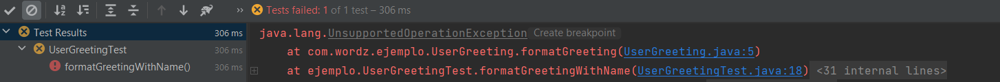
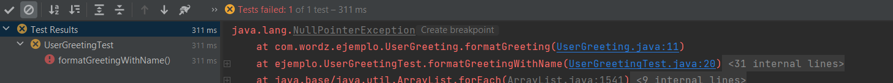
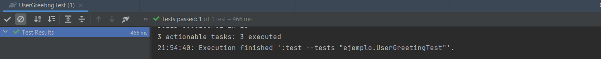
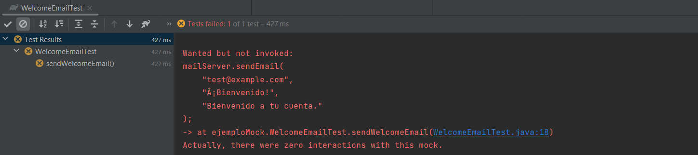
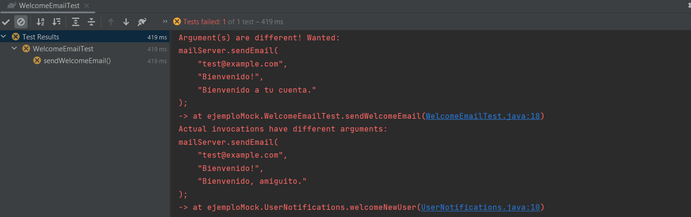
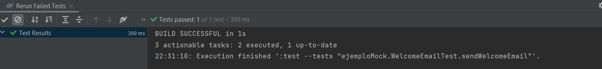

# Trabajando con Mockito <!-- omit in toc -->

> Esta actividad es individual y la continuación de la anterior actividad de doble de pruebas.

- [Introducción](#introducción)
- [Escribiendo un stub con Mockito](#escribiendo-un-stub-con-mockito)
- [Escribiendo un mock con Mockito](#escribiendo-un-mock-con-mockito)
	- [Borrando la distinción entre stubs y mocks](#borrando-la-distinción-entre-stubs-y-mocks)
- [Comparadores (matchers) de argumentos](#comparadores-matchers-de-argumentos)
- [Manejo del código de errores con pruebas](#manejo-del-código-de-errores-con-pruebas)
- [Ejercicio con Wordz](#ejercicio-con-wordz)


## Introducción

Mockito es una librería de código abierto gratuita que proporciona una amplia gama de funciones destinadas a crear dobles de prueba con muy poco código. 
El sitio web de Mockito se puede encontrar en https://site.mockito.org/. 

Para comenzar extraemos la librería Mockito y una librería de extensión en el  archivo Gradle. La librería de extensiones permite que Mockito se integre estrechamente con JUnit5. 

El extracto de build.gradle se ve así: 

```java
dependencies {
	testImplementation 'org.junit.jupiter:junit-jupiter-
api:5.8.2'
	testRuntimeOnly 'org.junit.jupiter:junit-jupiter-
engine:5.8.2'
	testImplementation 'org.assertj:assertj-core:3.22.0'
	testImplementation 'org.mockito:mockito-core:4.8.0'
	testImplementation 'org.mockito:mockito-junit-
jupiter:4.8.0'
}

```

## Escribiendo un stub con Mockito

Veamos cómo Mockito nos ayuda a crear un objeto stub. Usaremos TDD para crear una clase `UserGreeting` que brinde un saludo personalizado, después de obtener el apodo de la interfaz `UserProfiles`. 

Escribamos esto usando pequeños pasos, para ver cómo TDD y Mockito funcionan juntos: 

1. Escribe la clase de prueba básica JUnit5 e intégrela con Mockito:

```java
import org.junit.jupiter.api.extension.ExtendWith;
import org.mockito.junit.jupiter.MockitoExtension;

@ExtendWith(MockitoExtension.class)
    public class UserGreetingTest {
}
``` 
`@ExtendWith(MockitoExtension.class)` marca esta prueba como usando Mockito. Cuando ejecutamos esta prueba JUnit5, la anotación garantiza que se ejecute el código de la librería Mockito.

2. Agrega una prueba que confirme el comportamiento esperado. Capturaremos esto en una aserción:

```java
import org.junit.jupiter.api.Test;
import org.junit.jupiter.api.extension.ExtendWith;
import org.mockito.junit.jupiter.MockitoExtension;
import static org.assertj.core.api.Assertions.assertThat;
@ExtendWith(MockitoExtension.class)
public class UserGreetingTest {
	@Test
	void formatsGreetingWithName() {
    	String actual = "";
    	assertThat(actual)
       	.isEqualTo("Hola y bienvenido, Kapumota");
	}
}
``` 
Este es el uso estándar de los frameworks JUnit y AssertJ como hemos visto antes. 

**Problema:** ¿Qué sucede si ejecutas la prueba ahora?. 

**Respuesta:** Evidentemente, al comparar la cadena vacía con la cadena esperada que está ahí, la prueba va a fallar.


3. Elimina el SUT, la clase que queremos escribir, con un paso Act: 

```java
import org.junit.jupiter.api.Test;
import org.junit.jupiter.api.extension.ExtendWith;
import org.mockito.junit.jupiter.MockitoExtension;

import static org.assertj.core.api.Assertions.assertThat;

@ExtendWith(MockitoExtension.class)
public class UserGreetingTest {
	private static final UserId USER_ID
    	= new UserId("1234");
	@Test
	void formatsGreetingWithName() {
    	var greeting = new UserGreeting();
    	String actual =
        	greeting.formatGreeting(USER_ID);
    	assertThat(actual)
        	.isEqualTo("Hola bienvenido, Kapumota");
	}
}

```

Este paso elimina las dos nuevas clases de código de producción, como se muestra en los siguientes pasos. 

4. Agrega un esqueleto de clase `UserGreeting`: 

```java
public class UserGreeting {
	public String formatGreeting(UserId id) {
    	throw new UnsupportedOperationException();
	}
}

``` 
Como de costumbre, no agregamos código más allá de lo que se requiere para compilar la prueba. 
La decisión de diseño capturada aquí muestra que el comportamiento es proporcionado por un método `formatGreeting()`, que identifica a un usuario por una clase `UserId`. 

5. Agrega un esqueleto de ID de usuario de clase:

``` java
public class UserId {
	public UserId(String id) {
	}
}
```
**Problema:** ¿Qué sucede si ejecutas la prueba ahora?.  Explica la salida.

**Respuesta:**

Esta es la salida:



Aquí se ve que el caso de prueba falla en el paso Act, no en el paso Asert. Esto es porque la implementación del método evaluado lanza una excepción.

6. Otra decisión de diseño a capturar es que la clase `UserGreeting` dependerá de una interfaz `UserProfiles`. 
Necesitamos crear un campo, crear el esqueleto de la interfaz e inyectar el campo en un nuevo constructor para el SUT

```java
import org.junit.jupiter.api.Test;
import org.junit.jupiter.api.extension.ExtendWith;
import org.mockito.junit.jupiter.MockitoExtension;
import static org.assertj.core.api.Assertions.assertThat;
@ExtendWith(MockitoExtension.class)
public class UserGreetingTest {
	private static final UserId USER_ID
    	    = new UserId("1234");
             private UserProfiles profiles;
	@Test
	void formatsGreetingWithName() {
    	var greeting
        	       = new UserGreeting(profiles);
    	String actual =
        	         greeting.formatGreeting(USER_ID);
    	assertThat(actual)
        	         .isEqualTo("Hola y bienvenido Kapumota");
	}
}

```
Continuamos agregando el código mínimo para que la prueba se compile. 

**Problema:** ¿Qué sucede si ejecutas la prueba ahora?. Explica la salida.


**Respuesta:** Sigue saliendo el mismo error, ya que el método evaluado `formatGreeting()` sigue siendo el mismo.

7. Agrega comportamiento al método `formatGreeting()`: 

```java
public class UserGreeting {
	private final UserProfiles profiles;
	public UserGreeting(UserProfiles profiles) {
    	this.profiles = profiles;
	}
 public String formatGreeting(UserId id) {
    	return String.format("Hola y  Bienvenidos, %s",
            	profiles.fetchNicknameFor(id));
	}
}
``` 

8. Agrega `fetchNicknameFor()` a la interfaz `UserProfiles`.

9. Ejecute la prueba. ¿Qué sucede?.



Ahora la variable `profiles` que se le pasa al constructor `UserGreeting()` es nula, pero el método evaluado la utiliza internamente para llamar al método fetchNicknameFor(). Se lanza una expeción de NullPointerException siempre que esto pasa, por eso la prueba falla. Este sería un buen momento para agregar un doble de prueba que entregue alguna lista simulada de perfiles. Sería un doble que implementa la interface `UserProfiles`.

10. Agrega la anotación `@Mock` al campo `profiles`: 

```java
import org.junit.jupiter.api.Test;
import org.junit.jupiter.api.extension.ExtendWith;
import org.mockito.Mock;
import org.mockito.junit.jupiter.MockitoExtension;
import static org.assertj.core.api.Assertions.assertThat;
@ExtendWith(MockitoExtension.class)
public class UserGreetingTest {
     private static final UserId USER_ID = new
        UserId("1234");

        @Mock
        private UserProfiles profiles;

         @Test
	void formatsGreetingWithName() {
    	    var greeting = new UserGreeting(profiles);
    	
               String actual =
           	         greeting.formatGreeting(USER_ID);
    	
               assertThat(actual)
            	.isEqualTo("Hola y bienvenido  Kapumota");
	}
}
```
**Problema:** ¿Qué sucede si ejecutas la prueba ahora?. Explica la salida.

**Respuesta:** La prueba ya no falla por una excepción, sino porque el assert no se cumple. Esto es lo que deseamos que ocurra en el paso Assert, así que vamos bien.

Se puede notar la diferencia visualmente si vemos el ícono de X dentro de un círculo amarillo que encabeza el nombre del caso de prueba que falló, a la izquierda. Antes era un signo de admiración dentro de un círculo rojo, lo cual significa que ocurrió una excepción antes de que el assert se puediera verificar. Este es el nuevo resultado:


Ahora, ¿por qué ocurrió esto? Solo agregamos la etiqueta `@Mock` a la variable `profiles`. Parece que lo que hizo fue "darse cuenta" de que el tipo de dato de salida del método llamado por este objeto es de tipo String, para luego simular que retorna un String predefinido en esta biblioteca: _null_. Si queremos aprovecharnos de esto para nuestra prueba, debemos saber cómo cambiar esa cadena predefinida por la que queremos: _Kapumota_.

11. Configura `@Mock` para devolver los datos del stub  correctos para la prueba.

```java
import org.junit.jupiter.api.Test;
import org.junit.jupiter.api.extension.ExtendWith;
import org.mockito.Mock;

import org.mockito.Mockito;
import org.mockito.junit.jupiter.MockitoExtension;
import static org.assertj.core.api.Assertions.assertThat;
import static org.mockito.Mockito.*;
@ExtendWith(MockitoExtension.class)
public class UserGreetingTest {

     private static final UserId USER_ID = new
     UserId("1234");
	
      @Mock
       private UserProfiles profiles;
       
       @Test
	  void formatsGreetingWithName() {
    	      when(profiles.fetchNicknameFor(USER_ID))
       	               .thenReturn("Kapumota");
    	     var greeting = new UserGreeting(profiles);
    	     String actual =
           		greeting.formatGreeting(USER_ID);
    	assertThat(actual)
            	.isEqualTo("Hola y bienvenido, Kapumota");
	}
}
```

12. ¿Qué sucede si vuelves a ejecutar la prueba?. 

La prueba por fin pasó:



## Escribiendo un mock con Mockito

Mockito puede crear objetos mocks con la misma facilidad que los stubs. Todavía podemos usar la anotación `@Mock` en un campo que deseamos convertir en un mock, quizás dando sentido a la anotación. 
Usamos el método de `verify()` de Mockito para verificar que el SUT llamó a un método esperado en un colaborador. Veamos cómo se usa un mock. Escribiremos una prueba para algún código SUT que esperamos enviar un correo electrónico a través de `MailServer`:

```java
@ExtendWith(MockitoExtension.class)
class WelcomeEmailTest {
	@Mock
	private MailServer mailServer;
	@Test
	public void sendsWelcomeEmail() {
    	var notifications
             	= new UserNotifications( mailServer );
    	notifications.welcomeNewUser("test@example.com");
    	verify(mailServer).sendEmail("test@example.com",
            	"Bienvenido!",
	"Bienvenido a tu cuenta");
	}
}
``` 
En esta prueba, vemos la anotación `@ExtendWith(MockitoExtension.class)` para inicializar Mockito y el formato familiar `Arrange`, `Act` y `Assert` del método de prueba. 
La nueva idea aquí está en la aseveración. Usamos el método de `verify()` de la librería de Mockito para verificar que el SUT haya llamado correctamente al método `sendEmail()`. 
La comprobación también verifica que se haya llamado con los valores de parámetro correctos. 

Mockito utiliza la generación de código para lograr todo esto. Envuelve la interfaz que etiquetamos con la anotación `@Mock` e intercepta todas y cada una de las llamadas. 
Almacena valores de parámetros para cada llamada. Cuando llegamos a usar el método `verify()` para confirmar que el método se llamó correctamente, Mockito tiene todos los datos que necesita para hacerlo. 

**Iniciativa de exploración:**

Aquí vemos cómo falla la prueba hecha con `verify()` debido a que el método `sendEmail()` del mock no fue invocado dentro del método `welcomeNewUser()` que queremos probar.



Ahora sí invocamos el método, pero con un mensaje incorrecto: _Bienvenido, amiguito._ La prueba falla, lo que nos dice algo más acerca de cómo funcionan los mocks. Con un mock no solo se busca verificar que un método del colaborador sea invocado dentro del SUT, sino también que sea invocado con los parámetros que queremos. Así falló:



Con los parámetros correctos, la prueba ya da verde:



Ahora ya sabemos cuál es la diferencia entre un stub y un mock. El stub simula tener una parte del comportamiento del colobarador para interactuar dentro del SUT, mientras que el mock no hace nada y solo sirve para verificar que un método del colaborador fue invocado como queremos dentro del SUT. Y lo que tienen en común es que en ambos necesitamos meter al doble de pruebas dentro del SUT, es decir, hacer una inyección de dependencias. Aquí vimos que podemos hacer esto a través del constructor, aunque podrían haber otras formas de hacerlo.

### Borrando la distinción entre stubs y mocks 

Una cosa a tener en cuenta sobre la terminología de Mockito es que difumina la distinción entre un stub y un objeto mock. 

En Mockito, creamos dobles de prueba que se etiquetan como objetos mocks. Pero en las pruebas, podemos usar estos dobles como un stub, un mock o incluso una mezcla de ambos. 

Configurar un doble de prueba para que sea tanto un stub como un mock es un olor a código de prueba. No está mal, pero vale la pena hacer una pausa para pensar. 

## Comparadores (matchers) de argumentos

Mockito proporciona métodos de librería llamados comparadores de argumentos. Estos son métodos estáticos que se usan dentro de las sentencias `when()` y `verify()`. 
Los comparadores de argumentos se utilizan para indicar a Mockito que responda a un rango de valores de parámetros, incluidos valores nulos y desconocidos, que podrían pasar a un método bajo prueba. 

La siguiente prueba utiliza un comparador de argumentos que acepta cualquier valor de `UserId`: 

```java
import ejemplos.UserGreeting;
import ejemplos.UserId;
import ejemplos.UserProfiles;
import org.junit.jupiter.api.Test;
import org.junit.jupiter.api.extension.ExtendWith;
import org.mockito.Mock;
import org.mockito.junit.jupiter.MockitoExtension;
import static org.assertj.core.api.Assertions.assertThat;
import static org.mockito.ArgumentMatchers.any;
import static org.mockito.Mockito.when;
@ExtendWith(MockitoExtension.class)
public class UserGreetingTest {
	@Mock
	private UserProfiles profiles;
      
    @Test
	void formatsGreetingWithName() {
		when(profiles.fetchNicknameFor(any()))
			.thenReturn("Kapumota");
		var greeting = new UserGreeting(profiles);
		String actual =
			greeting.formatGreeting(new UserId(""));
		assertThat(actual)
			.isEqualTo("Hola y bienvenido, Kapumota");
	}
}
``` 
Agregamos un comparador de argumentos `any()` al método `fetchNicknameFor()`. Esto le indica a Mockito que devuelva el valor esperado _Kapumota_ sin importar qué valor de parámetro se pase a `fetchNicknameFor()`. 

Mockito ofrece una serie de comparadores de argumentos, descritos en la documentación oficial de Mockito. 

Estos comparadores de argumentos son especialmente útiles cuando se crea un stub para simular una condición de error.

## Manejo del código de errores con pruebas

A medida que creamos el código, debemos asegurarnos de que maneje bien las condiciones de error. Algunas condiciones de error son fáciles de probar. 

Un ejemplo podría ser un validador de entrada de usuario. Para probar que maneja el error causado por datos no válidos, simplemente escribimos una prueba que te proporciona datos no válidos 
y luego escribimos una aseveración para verificar que se informó con éxito que los datos no eran válidos. Pero ¿qué pasa con el código que lo usa? 

Si el SUT es un código que responde a una condición de error planteada por uno de sus colaboradores, necesitamos probar esa respuesta de error.

Cómo lo probamos depende del mecanismo que elegimos para informar ese error. Es posible que estemos usando un código de estado simple, en cuyo caso, devolver ese código de error desde un código auxiliar funcionará muy bien. 

También es posible que hayamos elegido usar excepciones de Java para informar este error. Las excepciones son controvertidas. 
Si se usan incorrectamente, pueden conducir a un flujo de control muy poco claro en tu código. 
Sin embargo, necesitamos saber cómo probarlos, ya que aparecen en varias bibliotecas de Java y estilos de codificación internos. 

Afortunadamente, no hay nada difícil en escribir la prueba para el código de manejo de excepciones.

Comenzamos con la creación de un stub, usando cualquiera de los enfoques cubiertos en esta actividad.
Luego, debemos hacer arreglos para que el stub arroje la excepción apropiada cuando llamamos a un método.

Mockito tiene una buena función para hacer esto, así que veamos un ejemplo de prueba de Mockito que usa excepciones:

```java
@Test
	public void rejectsInvalidEmailRecipient() {
    	doThrow(new IllegalArgumentException())
        	.when(mailServer).sendEmail(any(),any(),any());
    	var notifications
        	= new UserNotifications(mailServer);
    	assertThatExceptionOfType(NotificationFailureException.class)
            .isThrownBy(()->notifications
				.welcomeNewUser("not-an-email-address"));
	}
```

Al comienzo de esta prueba, usamos Mockito `doThrow()` para configurar el objeto mock. Esto configura el objeto mock de Mockito `mailServer` para lanzar `IllegalArgumentException` cada vez que llamamos a `sendEmail()`, sin importar qué valores de parámetro enviemos. Esto refleja una decisión de diseño para hacer que `sendEmail()` arroje esa excepción como un mecanismo para informar  que la dirección de correo electrónico no era válida. 

Cuando el SUT llama a `mailServer.sendEmail()`  ese método lanzará `IllegalArgumentExeption`.

Para este ejemplo, decidimos envolver el SUT y volver a generar `IllegalArgumentException`. Elegimos crear una nueva excepción relacionada con la responsabilidad de las notificaciones de los usuarios. 
Lo llamaremos `NotificationFailureException`. Luego, el paso de aserción de la prueba usa el método de AssertJ `assertThatExceptionOfType()`. Esto realiza los pasos `Act` y `Assert` juntos. 

Llamamos al método SUT `welcomeNewUser()` y aseveramos que arroja el error `NotificationFailureException`. 

Podemos ver cómo esto es suficiente para desencadenar la respuesta de manejo de excepciones en el código SUT. 

Esto significa que podemos escribir la prueba y luego eliminar el código requerido. El código que escribimos incluirá un controlador `catch` para `InvalidArgumentException`. 

En este caso, todo lo que tiene que hacer el nuevo código es lanzar un error de `NotificationFailureException`. Esta es una nueva clase que crearemos que extiende `RuntimeException`. 
Hacemos esto para informar que algo salió mal mediante el envío de una notificación. Como parte de las consideraciones normales de capas del sistema, queremos reemplazar la excepción original por una
más general, que se adapta mejor a esta capa de código. 

## Ejercicio con Wordz  

En este ejercicio, aplicaremos lo que hemos aprendido escribiendo una prueba para una clase que elegirá una palabra al azar para que el jugador la adivine de un conjunto de palabras almacenadas. Crearemos una interfaz llamada `WordRepository` para acceder a las palabras almacenadas. Haremos esto a través de un método `fetchWordByNumber(wordNumber)`, donde `wordNumber` identifica una palabra. 

La decisión de diseño aquí es que cada palabra se almacene con un número secuencial a partir de 1 para ayudarnos a elegir una al azar.  

Estaremos escribiendo una clase `WordSelection`, que es responsable de elegir un número aleatorio y usarlo para obtener una palabra del almacenamiento que está etiquetada con ese número. Usaremos la interfaz `NumerosAleatorios` de antes. 

Para este ejemplo, la prueba cubrirá el caso en el que intentamos obtener una palabra de la interfaz de `WordRepository` pero por alguna razón, no está allí. Podemos escribir la prueba de la siguiente manera:  

 
```java
@ExtendWith(MockitoExtension.class) 
public class WordSelectionTest { 
    @Mock 
    private WordRepository repository; 
    @Mock 
    private NumerosAleatorios random; 
    @Test 

    public void reportsWordNotFound() { 
        doThrow(new WordRepositoryException()) 
                .when(repository) 
                  .fetchWordByNumber(anyInt()); 
        var selection = new WordSelection(repository, 
                                          random); 
        assertThatExceptionOfType(WordSelectionException.class) 
                .isThrownBy( 
                        ()->selection.getRandomWord()); 
    } 

} 
```

**Pregunta:**  Implementa el escenario de pruebas para el caso Wordz utilizando el framework Mockito.

