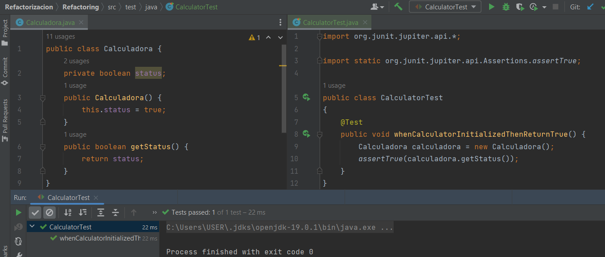
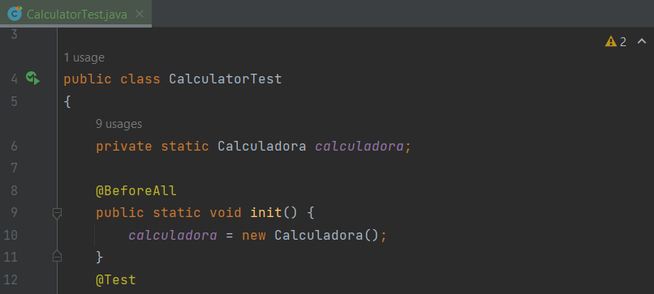
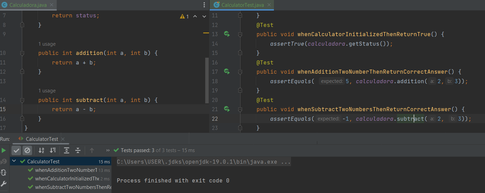
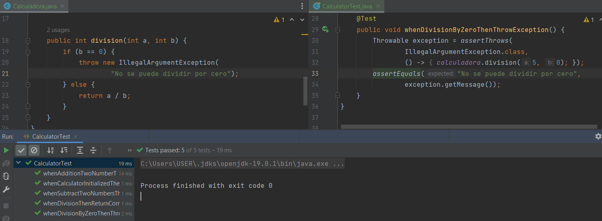
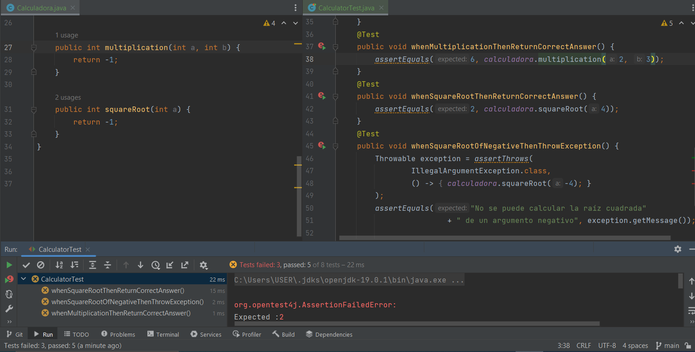
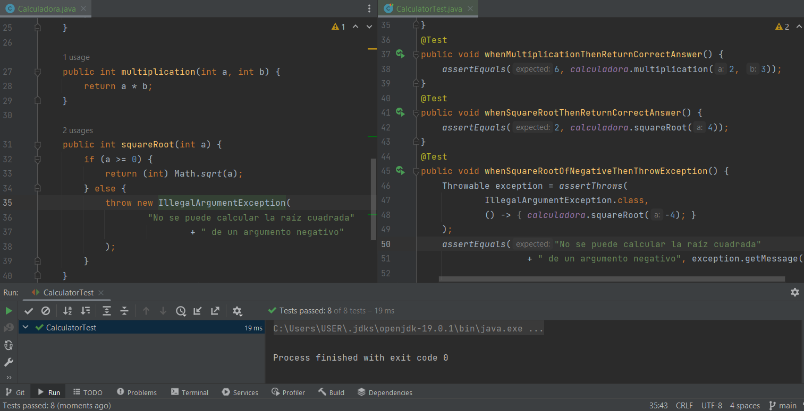

# Refactorización <!-- omit in toc -->

- [Actividad en clase](#actividad-en-clase)
- [Ejercicio](#ejercicio)
- [Conclusiones](#conclusiones)

## Actividad en clase

**Producto:** Una clase de calculadora simple. 

**Requisito 1:** El estado de la calculadora es verdadero cuando se inicializa correctamente. 

**Requisito 2:** La calculadora debe tener funciones de suma y resta. 

Para este segundo requisito elaboramos una pequeña refactorización del código de prueba. Como vamos a tener dos pruebas en las que necesitamos un objeto `calculadora`, es mejor preparar una instancia previamente a las preubas como tal. Esto lo hacemos con la anotación `@BeforeAll`.

A continuación eliminar la ahora innecesaria línea `Calculadora calculadora = new Calculadora();` de la prueba que acabamos de hacer, y escribimos de la misma forma la prueba para la suma y la resta.

**Requisito 3:** La calculadora debe tener función de división. Cuando alguien divide por cero, se debe lanzar una excepción.

## Ejercicio

> Agrega más funciones a la clase `Calculadora` utilizando los principios de TDD.

Vamos a agregar aquí los requisitos adicionales que luego se convertirán en código de prueba y de producción.

**Requisito 4:** La calculadora debe tener función de 
multiplicación.

**Requisito 5:** La calculadora debe tener función de raíz cuadrada. Cuando alguien calcula la raíz cuadrada de un número negativo, se debe lanzar una excepción.

Atajamos los requisitos 4 y 5 de una sola vez. Comenzamos con el código de prueba. Partimos del rojo, donde las tres pruebas que necesitamos hacer fallan.

Y ahora sí continuamos con la elaboración del código de producción. Las tres pruebas pasan.

## Conclusiones

Aprendimos de forma básica cómo es flujo de trabajo que debemos seguir como desarrolladores si queremos aplicar los métodos TDD y RGR.