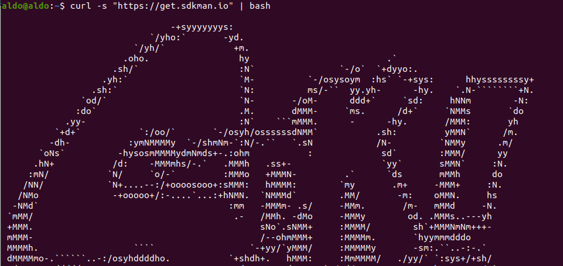

# Spring Boot <!-- omit in toc -->

> https://github.com/kapumota/Actividades/blob/main/Spring-Boot.md

## Instalación de SDKMAN y Spring Boot

En la página de [SDKMAN](https://sdkman.io/) se nos dice cómo instalarlo.

Y con esta herramienta instalamos Spring Boot:

## Patrón de diseño _convention over configuration_ y archivos JAR

## Preguntas

- ¿Cuál es el propósito de la anotación @SpringBootApplication?

    La anotación @SpringBootApplication se compone de otras tres anotaciones:
    - **@SpringBootConfiguration**: Marca una clase de configuración, la cual tiene al menos un método @Bean, y también activa la configuración automática de Spring Boot.  (Los métodos @Bean anotados en una clase de configuración se utilizan para crear y configurar instancias de objetos que se usarán en la aplicación).
    - **@EnableAutoConfiguration**: Habilita la configuración automática de Spring Boot.
    - **@ComponentScan**: Habilita la búsqueda automática de componentes en el paquete donde se encuentra la clase principal de la aplicación.

- ¿Cuáles son las principales diferencias entre el antiguo componente Spring para desarrollar servicios REST, Spring Web MVC y el nuevo Spring WebFlux?

    La principal diferencia es el manejo de los hilos. Spring Web MVC usa solo un hilo, mientras que Spring WebFlux no tiene ese bloqueo. Tener un bloqueado un solo hilo significa que, por ejemplo, tienes que esperar la respuesta de la base de datos.

- ¿Cómo ayuda springdoc-openapi a un desarrollador a documentar las API REST?

    La biblioteca springdoc-openapi genera documentación automáticamente para API REST compatibles con OpenAPI y creadas con Spring. Para generar esta documentación:
    - Inspecciona el código de la app en tiempo de ejecución.
    - Examina los puntos finales HTTP.
    - Examinas lsa anotaciones y los objetos devueltos

- ¿Cuál es la función de un repositorio en Spring Data y cuál es la implementación más simple posible de un repositorio?

    Un repositorio permite almacernar y acceder a los datos de diferentes bases de datos, siendo una abstracción que no distingue entre bases de datos SQL y NoSQL. 

    La implementación más simple de un repositorio es que una interfaz Java extienda la interfaz Repository como CrudRepository.

- ¿Cuál es el propósito de un binder en Spring Cloud Stream?

Un binder comunica la aplicación con el sistema de mensajería. Es una implementación de la interfaz de entrada y de salida.

- ¿Cuál es el propósito de Docker Compose?

Docker Compose es una herramienta que sirve para contruir y administrar múltiples servicios en contenedores Docker.Con Docker Compose se puede crear un archivo YAML para definir los servicios, y se pueden ejecutar todos con un solo comando.
