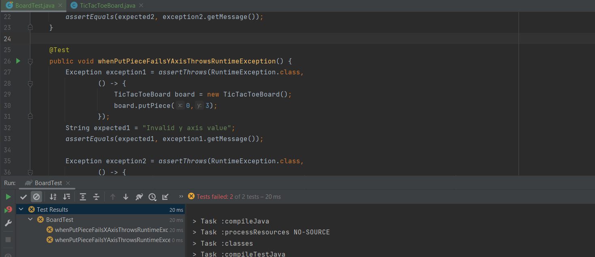
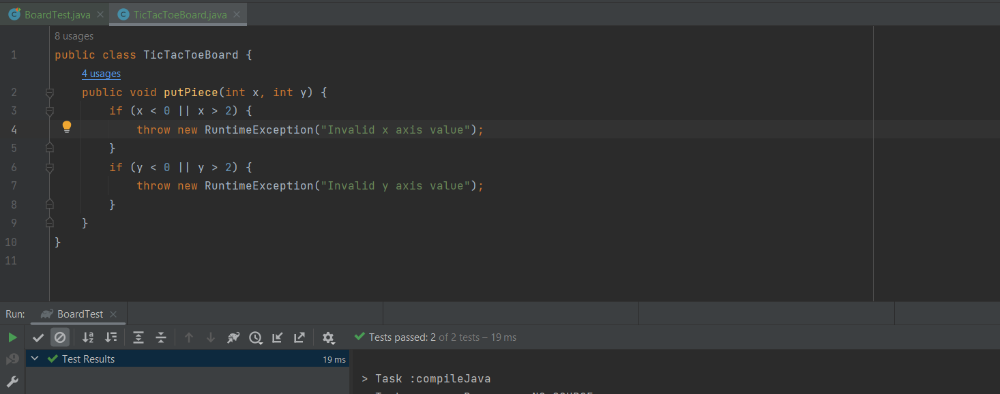
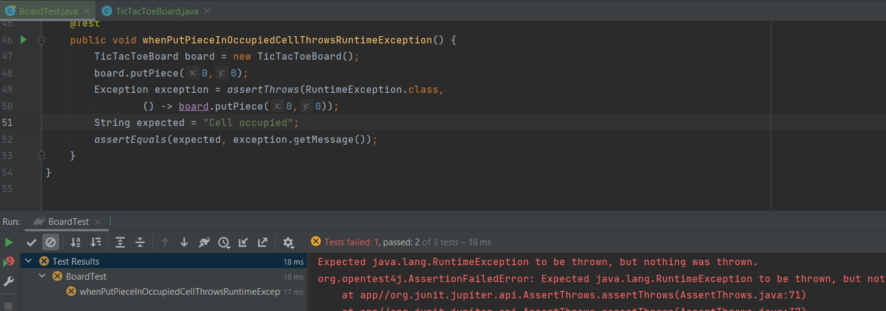
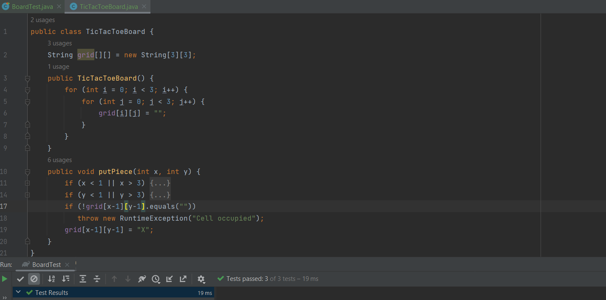
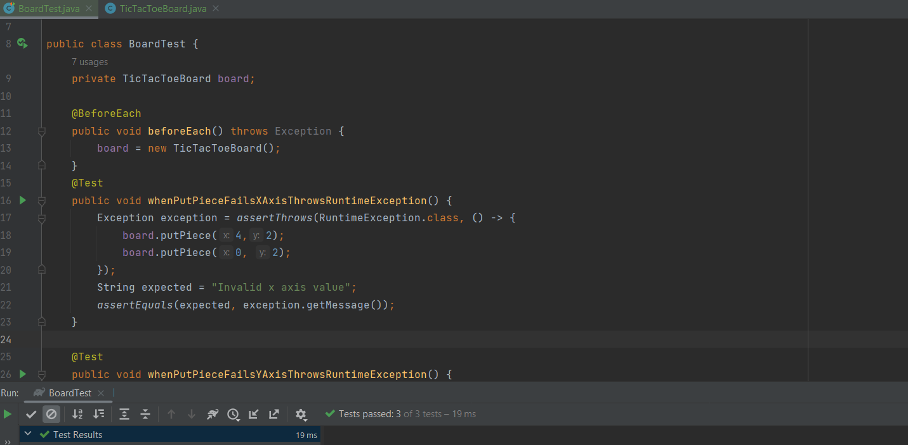
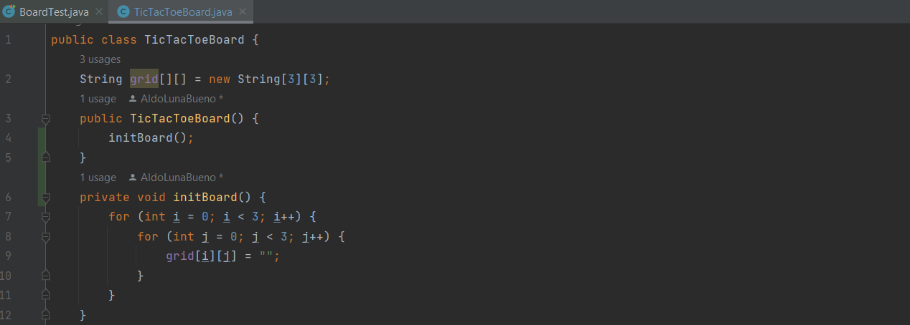
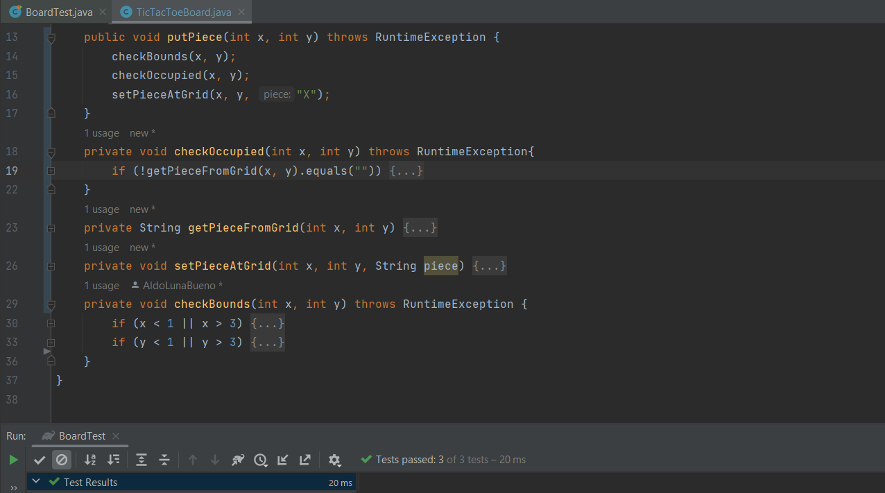
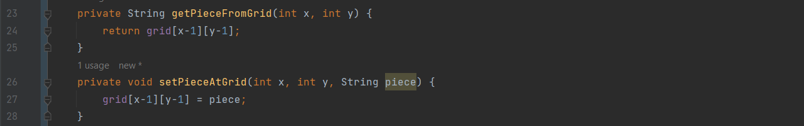

# Examen parcial - CC3S2 <!-- omit in toc -->

- [Pregunta 1. TicTacToe](#pregunta-1-tictactoe)
  - [Requisito 1. Colocación en el tablero](#requisito-1-colocación-en-el-tablero)
    - [Red-Green...](#red-green)
    - [... Refactor](#-refactor)
  - [Requisito 2. Turnos](#requisito-2-turnos)
    - [Red-Green...](#red-green-1)
    - [... Refactor](#-refactor-1)

## Pregunta 1. TicTacToe

### Requisito 1. Colocación en el tablero

#### Red-Green...

**1. Cuando una pieza se coloca en cualquier lugar fuera del eje x, se lanza RuntimeException**

El método para colocar la pieza no lo llamamos `jugar()`, sino `putPiece()` porque así empezamos a programarlo y nos parece más descriptivo. En el siguiente punto mostramos la implementación para este y el siguiente criterio de aceptación.

**2. Cuando una pieza se coloca en cualquier lugar fuera del eje y, se lanza RuntimeException**

**3. Cuando una pieza se coloca en un espacio ocupado, se lanza RuntimeException**

En este punto nos dimos cuenta de que habíamos presupuesto erróneamente que los límites de las entradas de la posición en el tablero iban de 0 a 2, porque así se maneja en la programación. Tuvimos que correrlo todo una unidad.

Ahora añadimos la matriz de cadenas `grid` para registrar las jugadas, y así avanzar un poco más la funcionalidad del método `putPiece()`. Si bien no hemos definido un sistema de turnos aún, al menos las jugadas se registran con una _X_ gracias a nuestro método:

#### ... Refactor

Aprovechamos para refactorizar las pruebas y así hacerlas más legibles y concisas usando varias anotaciones de JUnit4 como `@BeforeEach`:

Como se ve, las pruebas pasan.

Ahora sí refactorizamos el código de producción. Primero extraemos el bucle anidado que inicializa el tablero en el método `initBoard()`:

Luego extraemos las partes del método putPiece() en tres métodos:

Y, como se puede apreciar en la captura, las pruebas pasan, así que la refactorización no dañó nada.

Cabe resaltar que encapsulamos la variable `grid` para protegerla y disminuir el riesgo de equivocarnos o de que otro se equivoque en el tema del desplazamiento en una unidad (no usamos `grid[x][y]`, sino `grid[x-1][y-1]`). Para esto definimos un setter y un getter que detallamos en esta captura:

El setter se usa en `putPiece()` luego de las verificaciones, mientras que el getter se usa en el método extraído `checkOccupied()`.

### Requisito 2. Turnos

#### Red-Green...

**1. El primer turno lo debe jugar el jugador X.**

**2. Si el último turno fue jugado por X, entonces el próximo turno debe ser jugado por O**

**3. Si el último turno fue jugado por O, entonces el próximo turno debe ser jugado por X**

#### ... Refactor