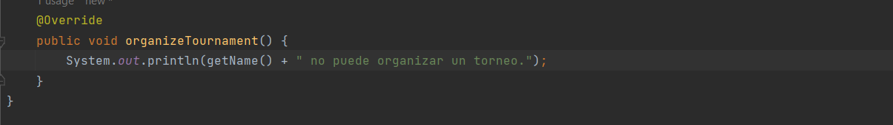

# Examen parcial - CC3S2 <!-- omit in toc -->

- [Pregunta 1. Members](#pregunta-1-members)
  - [Sin LSP](#sin-lsp)
  - [Refactorizando con LSP](#refactorizando-con-lsp)
- [Pregunta 2. TicTacToe](#pregunta-2-tictactoe)
  - [Requisito 1. Colocación en el tablero](#requisito-1-colocación-en-el-tablero)
    - [Red-Green...](#red-green)
    - [... Refactor](#-refactor)
  - [Requisito 2. Turnos](#requisito-2-turnos)
    - [Red-Green...](#red-green-1)
    - [... Refactor](#-refactor-1)

## Pregunta 1. Members

### Sin LSP

Creamos la clase base abstracta `Member` y la extendemos en las tres clases que representan los tipos de miembros o membresías: `PremiumMember`, `VipMember` y `FreeMemeber`. No hemos implementado nada aún, por lo que salen mensajes de error:

Sigamos con la solución sin LSP. Como la clase `FreeMember` debe implementar el método `organizeTournament()` ahora que ha extendido la clase abstracta, pero no queremos implementarla porque no es una función cubierta por esa membresía, intentamos lanzar una excepción. Sin embargo, el IDE no nos deja, y con mucha razón:

Entonces, solo mostraremos el mensaje:

Ahora creamos una clase `Cliente` que va a usar todas las clases implementadas previamente. Definimos un método `organizeTournametsByMemeber()` que toma una lista de miembros, sin importar de qué clase derivada sean, y hace uso del método `organizeTournament()` que en teoría implementan todas.

La lista de miembros es generada con `enrolledMembers()`. Pero entre los miembros que le pasamos hay uno de tipo `FreeMember`, para el cual su campo `name` es _Inspectora Motita_, así que no hará lo que el cliente espera.

Para que sea más interesante, añadimos un método a la clase abstracta para poder imprimir el nombre del miembro en los mensajes. Lo usamos en todas las clases de manera similar a como se muestra para la clase `PremiumMember`:

Este es el resultado de la ejecución del cliente:

### Refactorizando con LSP

El cliente no debe poder usar un miembro `FreeMember` para llamar el método `organizeTournament()`. Para impedir esto, borramos el método de la clase abstracta base `Member` y creamos otra clase abstracta que recoge este método. Llamamos a esta clase `OrganizerMember`. Entonces, así nos va quedando la implementación:

- `Member` no tiene `organizeTournament()`:
  

- `OrganizerMember` ahora tiene `organizeTournament()`:
  

- `FreeMember` extiende `Member`, así que no tiene `organizeTournament()`:
  

- `PremiumMember` extiende `OrganizerMember`, así que sí tiene `organizeTournament()`:
  

¿Y cuál será ese problema que nuestro IDE resalta en rojo? Pues que ahora el cliente no puede llamar el método `organizeTournament()` en todos los miembros de tipo `Member` a secas. 

Ahora tienen que ser de tipo `OrganizerMember`, pero esto a su vez obliga al cliente a replantear su lista de miembros generada por `enrolledMembers()`:

Sintiéndolo mucho, Inspectora Motita, tenemos que retirarla de la lista:

La ejecución ahora sí funciona como se espera, y el código ya está refactorizado siguiendo el principio LSP:

## Pregunta 2. TicTacToe

### Requisito 1. Colocación en el tablero

#### Red-Green...

**1. Cuando una pieza se coloca en cualquier lugar fuera del eje x, se lanza RuntimeException**

El método para colocar la pieza no lo llamamos `jugar()`, sino `putPiece()` porque así empezamos a programarlo y nos parece más descriptivo. En el siguiente punto mostramos la implementación para este y el siguiente criterio de aceptación.

**2. Cuando una pieza se coloca en cualquier lugar fuera del eje y, se lanza RuntimeException**

**3. Cuando una pieza se coloca en un espacio ocupado, se lanza RuntimeException**

En este punto nos dimos cuenta de que habíamos presupuesto erróneamente que los límites de las entradas de la posición en el tablero iban de 0 a 2, porque así se maneja en la programación. Tuvimos que correrlo todo una unidad.

Ahora añadimos la matriz de cadenas `grid` para registrar las jugadas, y así avanzar un poco más la funcionalidad del método `putPiece()`. Si bien no hemos definido un sistema de turnos aún, al menos las jugadas se registran con una _X_ gracias a nuestro método:

#### ... Refactor

Aprovechamos para refactorizar las pruebas y así hacerlas más legibles y concisas usando varias anotaciones de JUnit4 como `@BeforeEach`:

Como se ve, las pruebas pasan.

Ahora sí refactorizamos el código de producción. Primero extraemos el bucle anidado que inicializa el tablero en el método `initBoard()`:

Luego extraemos las partes del método putPiece() en tres métodos:

Y, como se puede apreciar en la captura, las pruebas pasan, así que la refactorización no dañó nada.

Cabe resaltar que encapsulamos la variable `grid` para protegerla y disminuir el riesgo de equivocarnos o de que otro se equivoque en el tema del desplazamiento en una unidad (no usamos `grid[x][y]`, sino `grid[x-1][y-1]`). Para esto definimos un setter y un getter que detallamos en esta captura:

El setter se usa en `putPiece()` luego de las verificaciones, mientras que el getter se usa en el método extraído `checkOccupied()`.

### Requisito 2. Turnos

#### Red-Green...

**1. El primer turno lo debe jugar el jugador X.**

**2. Si el último turno fue jugado por X, entonces el próximo turno debe ser jugado por O**

**3. Si el último turno fue jugado por O, entonces el próximo turno debe ser jugado por X**

#### ... Refactor