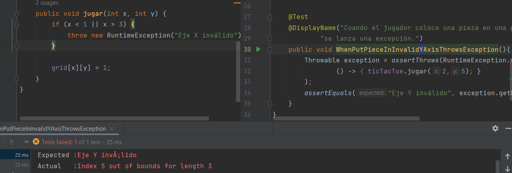
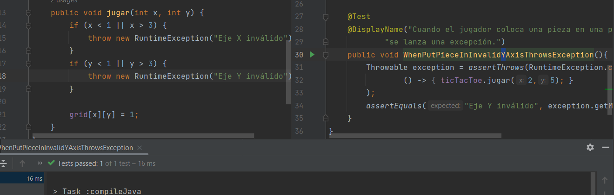

# Examen sustitutorio CC3S2 <!-- omit int toc -->

- [Examen sustitutorio CC3S2 ](#examen-sustitutorio-cc3s2-)
  - [Pregunta 1. RGR en Tic-Tac-Toe (10 pts.)](#pregunta-1-rgr-en-tic-tac-toe-10-pts)
    - [Requisito 1: colocación de piezas](#requisito-1-colocación-de-piezas)
      - [Prueba - limites del tablero I](#prueba---limites-del-tablero-i)
      - [Implementación](#implementación)
      - [Prueba - limites del tablero II](#prueba---limites-del-tablero-ii)
      - [Implementación](#implementación-1)
      - [Prueba - lugar ocupado](#prueba---lugar-ocupado)
  - [Pregunta 2. Mockito (5 pts.)](#pregunta-2-mockito-5-pts)
  - [Pregunta 3. Docker y Microservicios (5 pts.)](#pregunta-3-docker-y-microservicios-5-pts)

## Pregunta 1. RGR en Tic-Tac-Toe (10 pts.)

### Requisito 1: colocación de piezas

Comenzamos desde cero. Creamos la clase TicTacToc, en donde estará la lógica del juego. Para este requisito creamos la clase de prueba TestPiecePlacement, que tendrá un método de prueba para cada uno de los subrequisitos:

1. Prueba - limites del tablero I
2. Prueba - limites del tablero II
3. Prueba - lugar ocupado

#### Prueba - limites del tablero I

> Subrequisito: Cuando una pieza se coloca en una posición inválida del eje x, se lanza RuntimeException.

Primero creamos el método de prueba `WhenPutPieceInInvalidXAxisThrowsException()`, que codifica este subrequisito:

Como se ve, el método  `TicTacToe.jugar()` está en rojo, lo que indica que no ha sido creado aún. Ahora lo creamos y verificamos que la prueba falla:

Y, a continuación, implementamos lo suficiente para que pase:

#### Implementación   

Para la implementación creamos una matriz de ceros para representar los lugares vacíos del tablero, y el método `TicTacToe.jugar()` cambiará un cero por uno:

#### Prueba - limites del tablero II

Subrequisito: Cuando una pieza se coloca en una posición inválida del eje y, se lanza RuntimeException.

Análogamente, seguimos el mismo proceso de la prueba anterior. Creamos el método de prueba correspondiente al subrequisito y este falla porque todavía no hemos implementado la validación del eje y:

Con la validación las pruebas ya pasan:

#### Implementación

Este subrequisito no nos motiva a implementar nada nuevo.

#### Prueba - lugar ocupado 

Subrequisito: Cuando una pieza se coloca en un espacio ocupado, se lanza RuntimeException.

## Pregunta 2. Mockito (5 pts.)

## Pregunta 3. Docker y Microservicios (5 pts.)

