# Examen sustitutorio CC3S2 <!-- omit in toc -->

- [Pregunta 1. RGR en Tic-Tac-Toe (10 pts.)](#pregunta-1-rgr-en-tic-tac-toe-10-pts)
  - [Requisito 1: colocación de piezas](#requisito-1-colocación-de-piezas)
    - [Prueba - limites del tablero I](#prueba---limites-del-tablero-i)
    - [Prueba - limites del tablero II](#prueba---limites-del-tablero-ii)
    - [Prueba - lugar ocupado](#prueba---lugar-ocupado)
    - [Refactorización](#refactorización)
  - [Requisito 2](#requisito-2)
- [Pregunta 2. Mockito (5 pts.)](#pregunta-2-mockito-5-pts)
- [Pregunta 3. Docker y Microservicios (5 pts.)](#pregunta-3-docker-y-microservicios-5-pts)

## Pregunta 1. RGR en Tic-Tac-Toe (10 pts.)

### Requisito 1: colocación de piezas

Comenzamos desde cero. Creamos la clase TicTacToc, en donde estará la lógica del juego. Para este requisito creamos la clase de prueba TestPiecePlacement, que tendrá un método de prueba para cada uno de los subrequisitos:

1. Prueba - limites del tablero I
2. Prueba - limites del tablero II
3. Prueba - lugar ocupado

#### Prueba - limites del tablero I

> Subrequisito: Cuando una pieza se coloca en una posición inválida del eje x, se lanza RuntimeException.

Primero creamos el método de prueba `WhenPutPieceInInvalidXAxisThrowsException()`, que codifica este subrequisito:

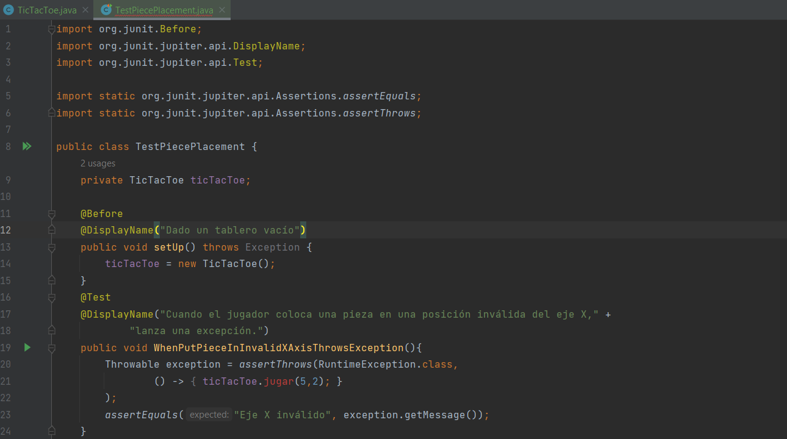

Como se ve, el método  `TicTacToe.jugar()` está en rojo, lo que indica que no ha sido creado aún. Ahora lo creamos y verificamos que la prueba falla:

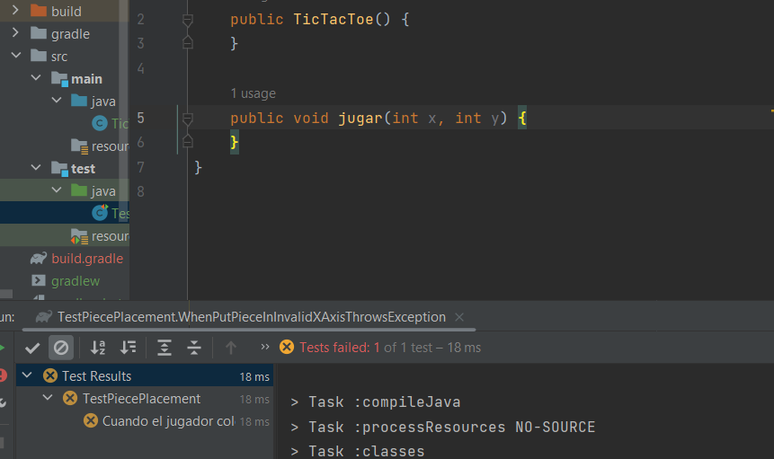

Y, a continuación, implementamos lo suficiente para que pase:

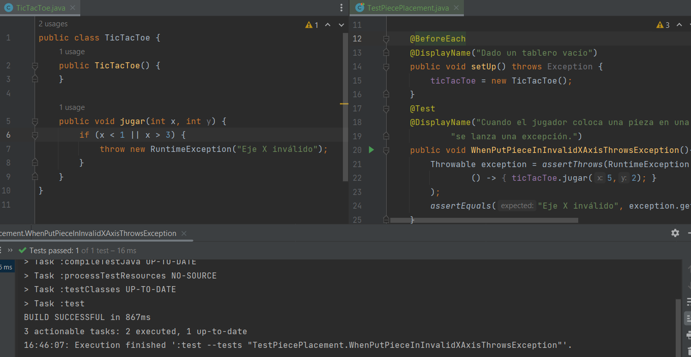

#### Prueba - limites del tablero II

Subrequisito: Cuando una pieza se coloca en una posición inválida del eje y, se lanza RuntimeException.

Análogamente, seguimos el mismo proceso de la prueba anterior. Creamos el método de prueba correspondiente al subrequisito y este falla porque todavía no hemos implementado la validación del eje y:

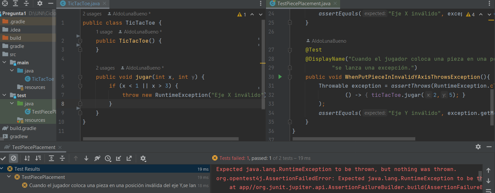

Con la implementación de la validación las pruebas ya pasan:

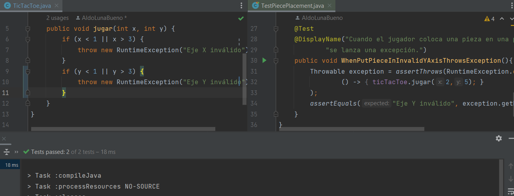

#### Prueba - lugar ocupado 

Subrequisito: Cuando una pieza se coloca en un espacio ocupado, se lanza RuntimeException.

Escribimos la prueba usando el método `TicTacToe.jugar()` en el paso Arrange y Act con la misma posición. La prueba no pasa:

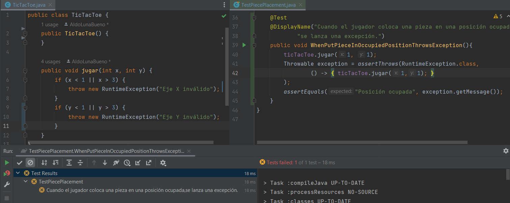

Para la implementación creamos una matriz de cadenas vacías  para representar los lugares vacíos del tablero, y el método `TicTacToe.jugar()` llenará la cadena vacía por una "X". Las pruebas ya pasan:

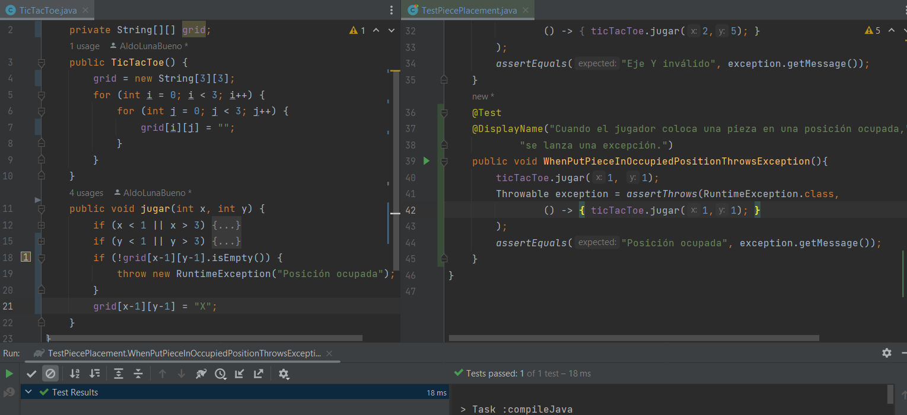

#### Refactorización

Extraemos una a una las partes diferenciables de nuestro método `TicTacToe.jugar()`. Nos ayudamos de IntelliJ para extraer el código en otros métodos:

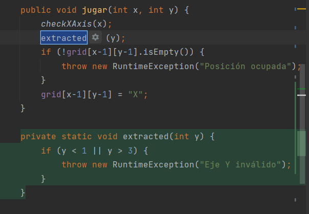

Así quedan el constructor, el método `TicTacToe.jugar()`, y todos los métodos producto de las extraciones:

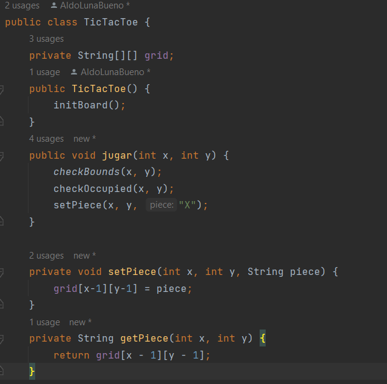
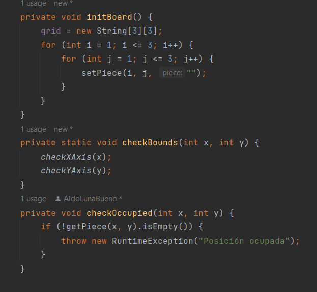
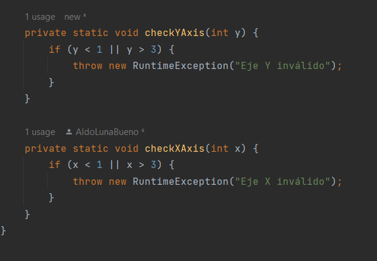

Pensamos que es importante resaltar una refactorización que hicimos: la extracción de los métodos `setPiece()` y `getPiece()`. Son el setter y el getter de la matriz de cadenas `grid`. Esta matriz se usa desde varias partes del código, como `initBoard()` y `checkOccupied()`. Por eso es que, sin esta refactorización, nos exponemos a cometer el error de introducir una pieza en una posición errónea simplemente por colocar x en vez de x-1 en la primera coordenada, por ejemplo.

Y, gracias a nuestras pruebas, podemos estar seguros de que no hemos dañado el código:

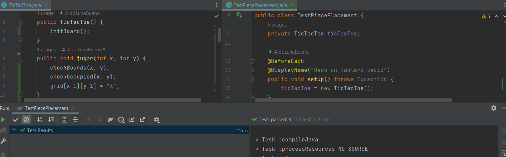

Corremos las pruebas con cobertura de código y obtenemos el siguiente reporte de JaCoCo:

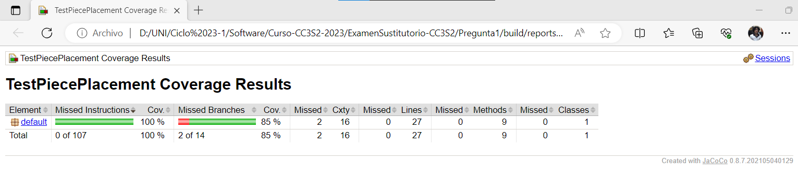

La cobertura no es completa cuando analizamos las ramas. 

Vemos en detalle el reporte:

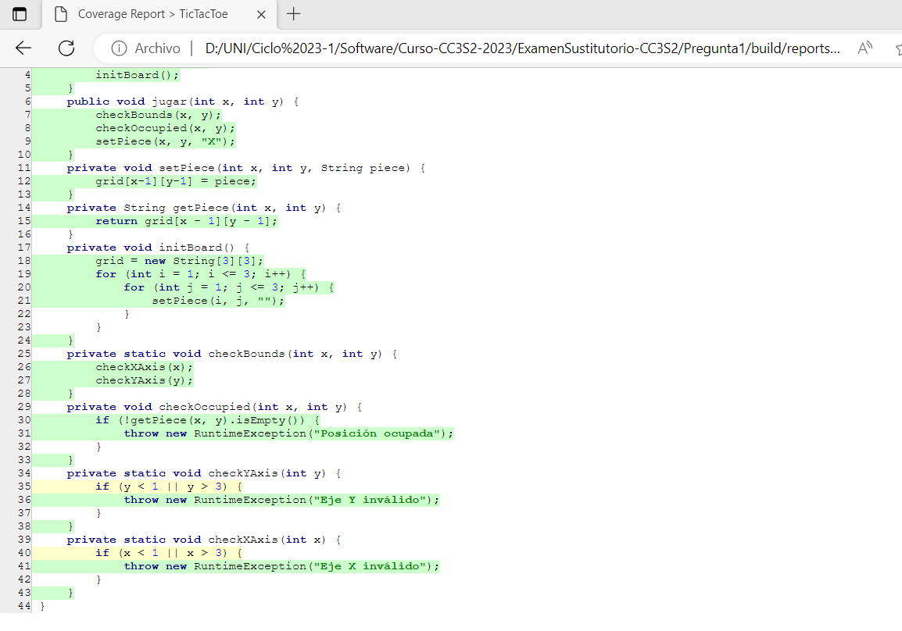

Y nos damos cuenta de que esto sucede porque no estamos cubriendo los casos en los que se coloca la pieza en una coordenada inválida del eje x o del eje y pero por debajo, es decir, con valores menores a 1.

Por esta razón, vamos a agregar esos casos que se nos escapan. Y, al hacerlo, elevaremos la calidad de nuestras pruebas, porque vamos a parametrizarlas:

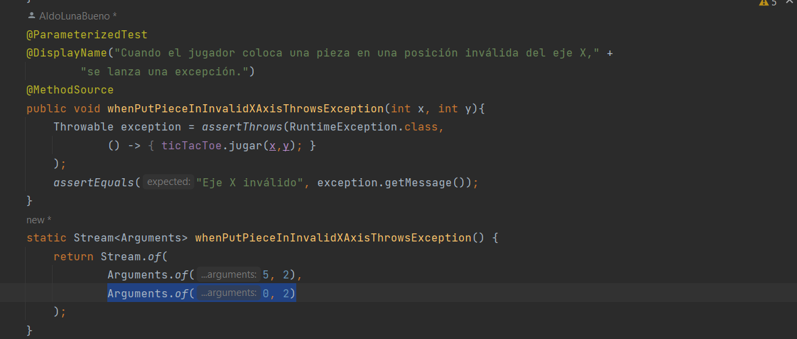

Como se ve en la imagen, agregamos una caso que invalída la colocación de una pieza en el eje x por debajo del límite, con 0. 

Hacemos lo mismo para la prueba que se encarga del otro eje y analizamos la cobertura de código:

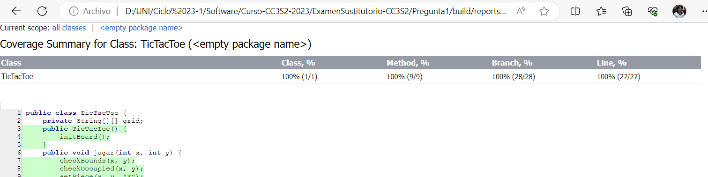

El reporte nos muestra que la cobertura de código en las ramas ahora es del 100 %.

### Requisito 2

## Pregunta 2. Mockito (5 pts.)

**Pregunta: Explica los resultados del archivo.json**

Obtenemos una respuesta JSON con tres claves. La clave _message_ tiene asociado el valor _success_, lo que significa que la solicitud fue exitosa. La clave _number_ tiene por valor 10, lo que indica que hay 10 astronautas en el espacio. Y la clave _people_ se asocia con un arreglo de objetos JSON que representan los datos de cada astronauta. 

Así, para cada astronauta tenemos la clave _name_, que representa su nombre, y la clave _craft_, que representa la estación espacial en la que está viajando por el espacio.

**Assignament y AstroResponse**

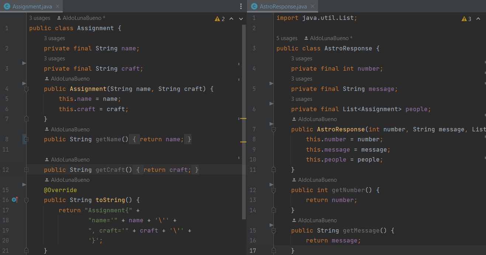

Se nos dice que creemos también getters y setters para los atributos, pero los setters no se puede crear porque los atributos tienen restricción _final_.

**AstroGateway**

Es nuestra clase de acceso a datos, y nos devuelve una instancia de AstroResponse con el método getResponse() sobreescrito de la interfaz Gateway. Implementamos la clase de la siguiente manera:

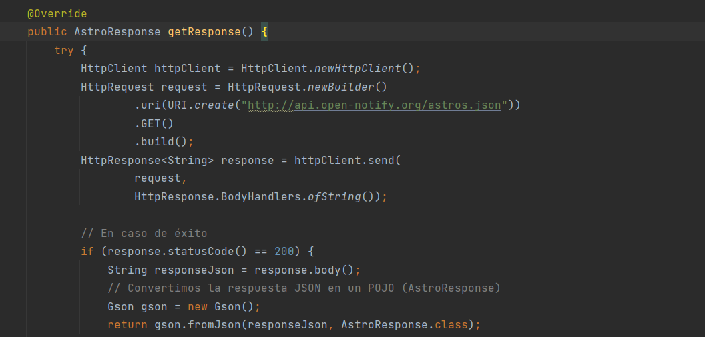

Con HttpClient enviamos la solicitud HTTP GET, por medio de su método send(), el cual nos entrega una respuesta HttpResponse. Para esto, antes usamos HttpRequest para dirigir la solicitud hacia la URL del servicio web RESTful.

De la respuesta obtenemos el objeto JSON, y convertimos este a un objeto POJO (AstroResponse). Esto conversión la hacemos gracias a una biblioteca de deserialización llamada GSON. Encontramos referencia a ella en [este artículo](https://www.baeldung.com/java-httpclient-map-json-response). De ahí copiamos la dependencia para nuestro _pom.xml_, y luego la actualizamos.

**AstroService**

Aplicando inyección de dependencias, no creamos una instancia de AstroGateway, sino que la inyectamos a través del constructor:

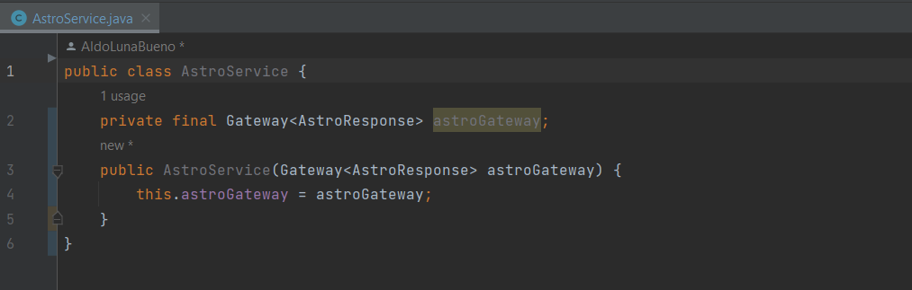

Ahora implementamos el método getAstroData() que se nos indica:

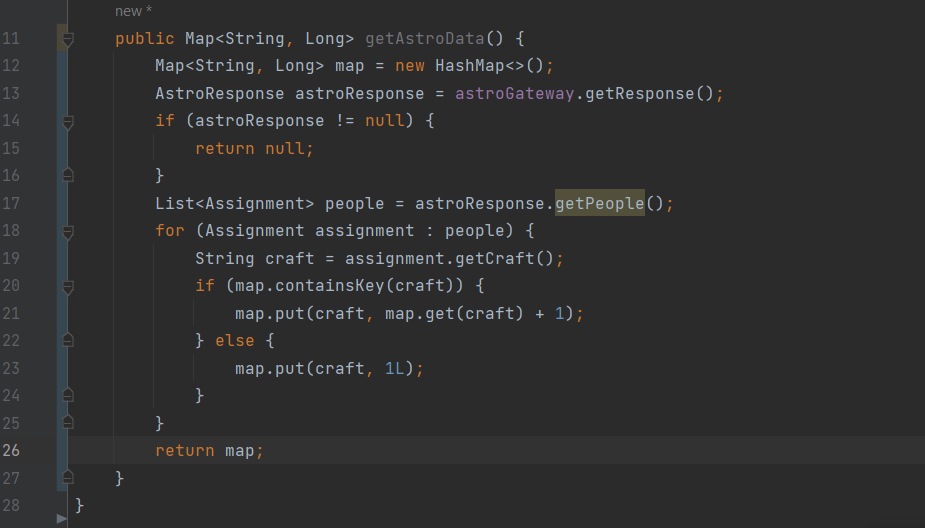

Este método nos entrega un HashMap que enumera cuántos astronautas hay en cada estación espacial. Para ello le pedimos la respuesta a astroGateway en forma de objeto AstroResponse, e iteramos por todas las personas representadas por la clase de asignaciones Assignment.

**Pregunta: Escribe una prueba de integración llamada AstroServiceTest.java**

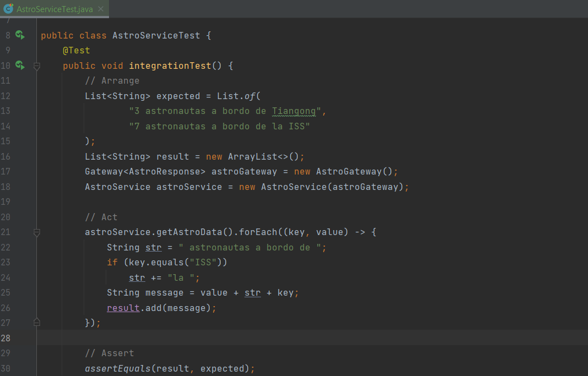

Esta es una prueba de integración porque estamos probando a la vez las clases AstroService y AstroGateway. El método AstroGateWay.getResponse() se usa dentro del método AstroService.getAstroData().

Para que la prueba sea más entendible, la hemos ordenado según el método AAA, aunque no es una prueba unitaria.

**Pregunta: Para usar Mockito, debes determinar las dependencias de la clase que está probando. ¿Para AstroService, cual es la única dependencia?**

De lo que explicamos en la anterior pregunta, está claro que la única dependencia de AutoService es AstroGateway.

**Pregunta:** Digamos que tu prueba de integración falló y ahora se quiere crear una prueba para AstroService. Una verdadera prueba unitaria para AstroService necesita un sustituto del gateway algún tipo de objeto falso (stub o mock) que devolverá exactamente lo que queremos cuando el servicio llame al método getResponse. No se quiere que ningún problema con el gateway afecte el éxito o el fracaso de las pruebas del servicio. **Proporciona tu propio objeto falso para en una clase llamada FakeGateway que codifica una respuesta.**

Implementamos la clase FakeGateway para sustituir a la clase AstroGateway. El método getResponse() solo retorna un objeto AstroResponse hardcodeado sencillo que no necesita de ninguna llamada al servicio web RESTful.

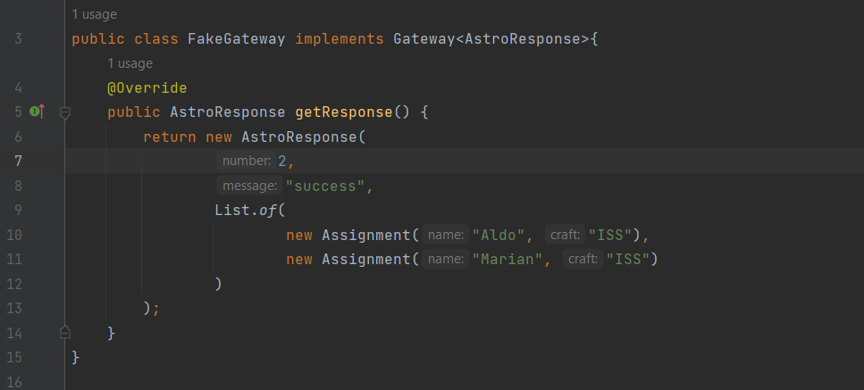

**Pregunta: Escribe una prueba unitaria del servicio que usa FakeGateway. ¿Cuál es la respuesta devuelta por el mock gateway? Explica tus resultados.**

Creamos otra prueba que esta vez, gracias a esta clase FakeGateway, será una prueba unitaria:

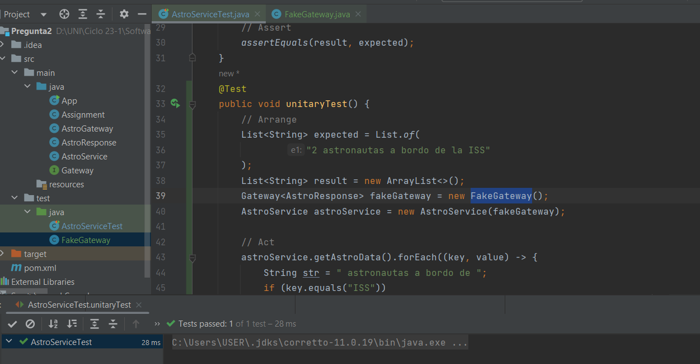

La prueba pasa sin ningún problema.

**Pregunta: Utiliza Mockito  en la  interfaz Gateway.** Confia en Mockito para crear el mock del gateway  y luego inyectaro en el servicio. **Verifica  que el servicio haya invocado el método getResponse en gateay exactamente una vez.**

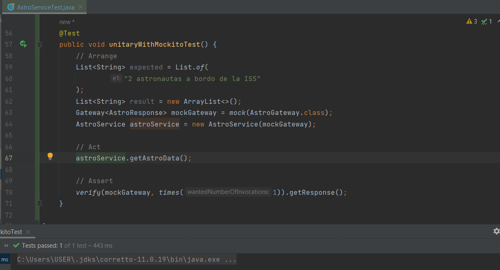

Primero creamos un mock de AstroGateway con el método mock() de Mockito. No nos intersa darle un comportamiento predefinido porque es un mock, no un stub. Lo inyectamos a AstroService, cuyo método getAstroData() llamamos a continuación.

En esta llamada el método AstroGateway.getResponse() debe ser invocado exactamente una vez. Eso es lo que verificamos con el método verify() de Mockito.

## Pregunta 3. Docker y Microservicios (5 pts.)

