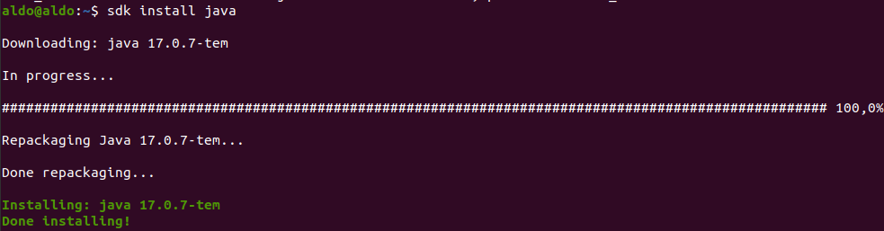
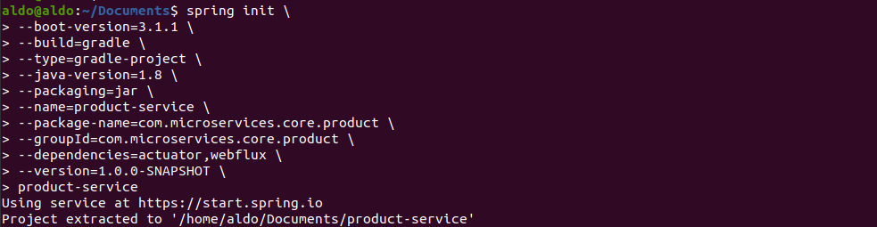
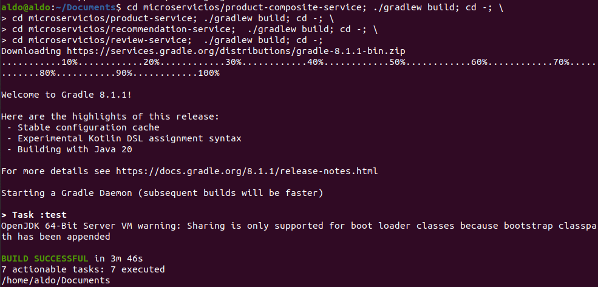
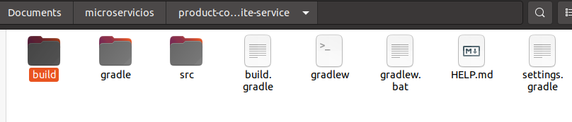
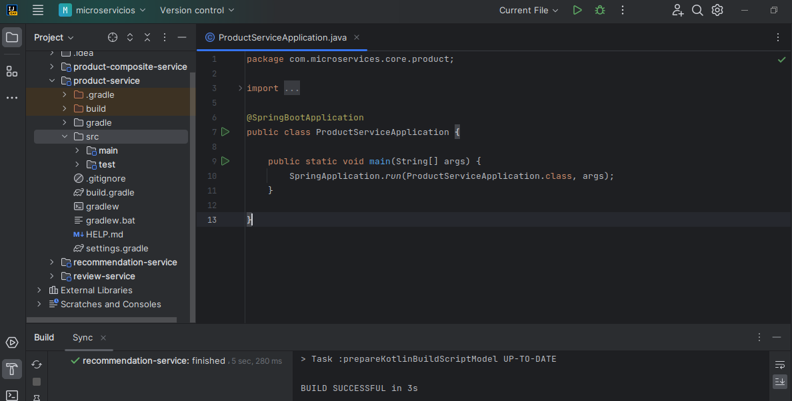

# Microservicios <!-- omit in toc -->


> https://github.com/kapumota/Actividades/blob/main/Microservicios-cooperativos.md

## Introducción

En esta actividad, construiremos el primer par de microservicios. Aprenderemos a crear microservicios cooperativos con funcionalidad minimalista. Luego agregaremos más y más funciones a estos microservicios.

Al final de esta actividad, tendremos una API RESTful expuesta por un microservicio compuesto.

El microservicio compuesto llamará a otros tres microservicios utilizando sus API RESTful para crear una respuesta agregada.

## Panorama de los microservicios

## Código esqueleto para los microservicios

Para usar Spring Boot primero debemos tener Java instalado y configurado como variable de entorno (JAVA_HOME). Estas dos cosas se hacen automáticamente con el instalador SDKMAN con el comando `sdk install java`:



De la misma manera instalamos Spring Boot con `sdk install springboot`. Debemos poder ver la versión que tenemos instalada:


Solo necesitamos el comando `spring init` para crear el esqueleto. Lo más fácil es usar la página https://start.spring.io/, y luego descomprimir el proyecto descargado. Nosotros usaremos Spring CLI desde el terminal para cada uno de los cuatro servicio de forma análoga a como sigue:

```bash
spring init \
--boot-version=3.1.1 \
--build=gradle \
--type=gradle-project \
--java-version=1.8 \
--packaging=jar \
--name=product-service \
--package-name=com.microservices.core.product \
--groupId=com.microservices.core.product \
--dependencies=actuator,webflux \
--version=1.0.0-SNAPSHOT \
product-service
```



Importante cuidar que no haya espacios después de las barras invertidas (\).

Construimos cada miscroservicio por separado:

```bash
cd microservicios/product-composite-service; ./gradlew build; cd -; \
cd microservicios/product-service; ./gradlew build; cd -; \
cd microservicios/recommendation-service;  ./gradlew build; cd -; \
cd microservicios/review-service;  ./gradlew build; cd -;
```



El resultado es esta nueva carpeta en cada proyecto:



## Implementando proyectos API y Util

Ambos se empaquetan como una biblioteca, es decir, no tendrán su propia clase de aplicación `main`. Spring Initialzr no soporta la creación de proyectos de biblitoeca.  Por eso se tienen que hacer manualmente.

Cuando abrimos los proyectos en IntelliJ, nos puede salir este error luego de construir con Gradle:

Para solucionarlo seguimos la indicación de borrar los archivos _.idea/gradle.xml_ y _.idea/workspace.xml_ tal como se recomienda en [este foro](https://stackoverflow.com/questions/30328994/invalid-gradle-jdk-configuration-found).

Así se debe verse todo:



