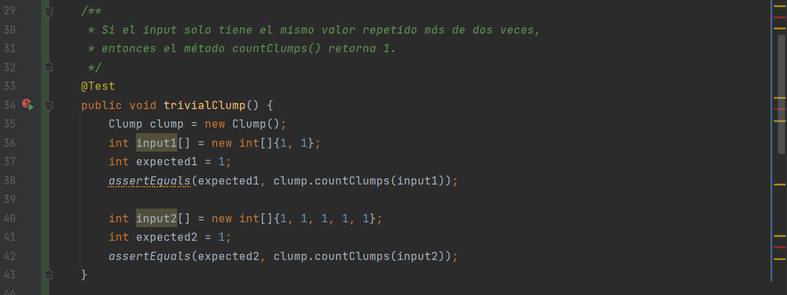
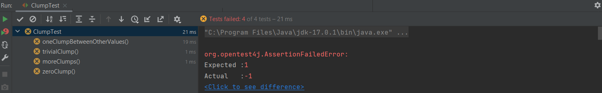

# Práctica calificada 4 <!-- omit in toc -->

- [Pregunta 1](#pregunta-1)
  - [Parte 2 y 3. Pruebas](#parte-2-y-3-pruebas)
  - [Parte 1. Implementación](#parte-1-implementación)
  - [Parte 4](#parte-4)
- [Pregunta 2](#pregunta-2)
- [Pregunta 3](#pregunta-3)

## Pregunta 1

Como seguimos las metodología TDD y RGR, vamos primero a hacer las pruebas y luego la implementación.

### Parte 2 y 3. Pruebas

Empezamos con una implementación mínima que haga fallar todas las pruebas al retornar un valor no esperado:

Escribimos e implementamos los casos de prueba de la siguiente forma:

Escribimos otras dos pruebas como esta:

Y agregamos una prueba adicional T4 que prueba más casos límite:

Posteriormente, si el método fuera muy importante, haría falta una refactorización de las redundancias con utilidades como las pruebas paramétricas.

Lo que importa es que todas y cada una de las pruebas dan rojo, fallaron:

### Parte 1. Implementación

Esta es la primera aproximación a la solución del problema de encontrar en un arreglo de valores cuántas secuencias de más de dos valores iguales hay:

Y logramos que todas las pruebas den verde en el primer intento:

### Parte 4

Usamos la cobertura de código que nos proporciona JaCoCo. Para esto lo configuramos para nuestras pruebas:

Y obtenemos el siguiente resultado:

## Pregunta 2

## Pregunta 3

Implementamos como nos piden una sistema mínimo de reservas con una pequeña documentación en el método clave:

