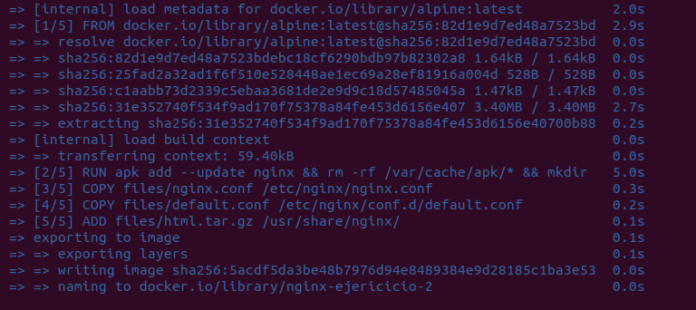
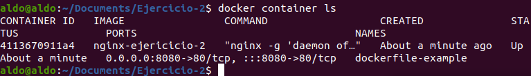
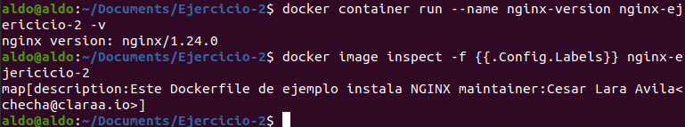
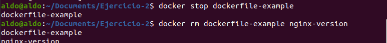

## Ejercicio 1

## Ejericio 2. Contenedor Docker de nginx

Una vez que ya creamos el archivo Dockerfile y guardamos los archivos adicionales en una carpeta _files_, ejecutamos el siguiente comando:

```bash
docker build -t nombre-de-la-imagen-a-crear
```
Se nos sugiere que el nobmre de la imagen sea dockerfile-example, pero nosotros usamos el nombre _nginx-ejericicio-2_ para ser más descriptivos (tiene un error ortográfico, pero seguimos adelante).



Comprobamos que la imagen se creó como especificamos:


Creamos un contenedor de ejemplo y también lo comprobamos:



Comprobamos que funciona en servidor local:


Y aquí detenemos su ejecución y lo eliminamos:





## Ejercicio 3


## Ejercicio 4

La automatización de infraestructura consiste en reducir la intervención humana en tareas como controlar el hardware, el software, los elementos de red, el sistema operativo y el almacenamiento de datos. Según el artículo, la automatización de la infraestructura de los microservicios se da en sus etapas de creación, implementación y operación. Las técnicas de automatización de la infraestructura, como la integración continua, la entrega continua y las pruebas automatizadas, sirven de gran ayuda a los equipos.

Un detalle importante que puede ser difícil de manejar tiene que ver con el ámbito de las operaciones y el mantenimiento: la resistencia al fallo. Mientras que en una arquitectura monolítica todo está cohesionado y es más difícil que los componentes fallen, en una arquitectura de microservicios la aplicación es la suma de varios servicios, y en cualquier momento uno de ellos puede fallar. Una solución puede ser duplicar los servicios que son más propensos a fallar (redundancia). Otra puede ser administrar de forma automática los posibles fallos de los servicios. Como dicen en el artículo, esta es la parte más difícil de la automatización de los microservicios, y esencialmente se debe al aumento de la complejidad con respecto a la arquitectura monolítica.
